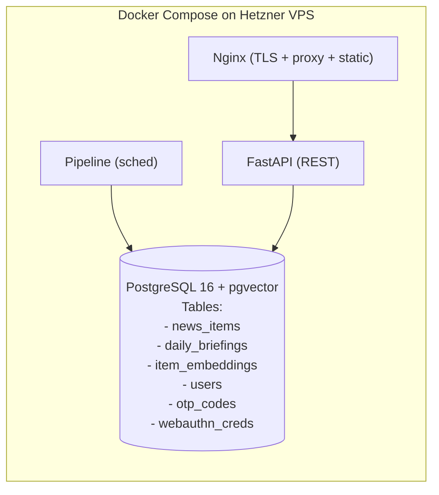
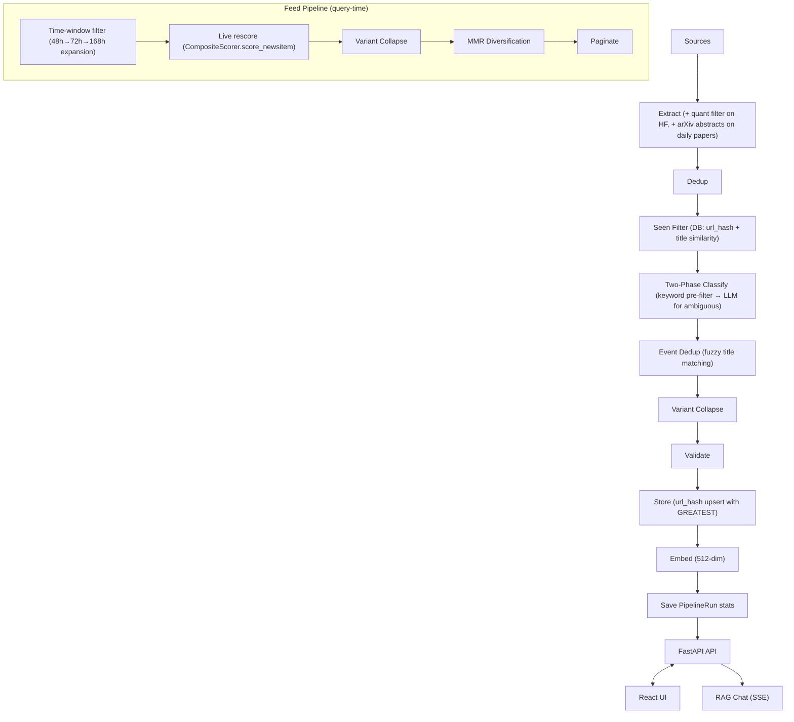

# AGENTS.md — AI News Platform

> **Last updated**: 2026-06-13 | **Current milestone**: Production Quality & Observability | **Status**: Active

## Project Overview

**AI News Platform** is a web-based AI news aggregation, classification, and search platform. It extracts news from multiple sources (HackerNews keyword + leading, arXiv, RSS, GitHub Trending, GitHub Search, HuggingFace, WebScraper; Reddit present but disabled by default), classifies them using LLM (Kimi/Moonshot), stores in PostgreSQL with pgvector embeddings, and serves via a FastAPI REST API + React frontend. Includes RAG-based Q&A chat.

**Evolved from**: `x-news-summarizer` (Telegram-only pipeline). This project adds a web UI, database, full-text search, RAG chat, and MCP integration.

**Key facts**:
- **Audience**: Public (guest tokens for read-only access) + registered users (OTP + WebAuthn passkeys)
- **Development**: 100% by AI agents. Zero human coding.
- **Infrastructure**: Hetzner VPS (4GB RAM, ~5 EUR/month)
- **LLM**: Kimi/Moonshot API (OpenAI-compatible, cheapest option)
- **Tests**: 1,179+ passed (after Telegram removal), 92% coverage
- **Embeddings**: 512 dimensions (text-embedding-3-small, native)

## Architecture



### Data Flow



## How to Run

### Development
```bash
# Setup
git clone <repo> && cd ai-news-platform
cp .env.example .env  # Fill in secrets
python -m venv .venv && source .venv/bin/activate
pip install -e ".[api,pipeline,dev]"
git config core.hooksPath .githooks

# Database (requires Docker for PostgreSQL)
docker compose up db -d
alembic upgrade head

# Run API
uvicorn src.api.app:app --reload --port 8000

# Run tests
pytest tests/ -v
```

### Production (Docker)
```bash
docker compose up -d                                          # Core services (db, api, nginx)
docker compose --profile pipeline run --rm pipeline           # One-off pipeline run
docker compose --profile cron up -d pipeline-cron             # Scheduled pipeline (daily)
```

### Pipeline (manual run)
```bash
python -m src.main
```

## File Map

```
ai-news-platform/
├── AGENTS.md / CLAUDE.md            # Agent guide / coding conventions
├── pyproject.toml                    # Dependencies + tool config
├── Dockerfile.api / Dockerfile.pipeline / docker-compose.coolify.yml
├── alembic/                          # DB migrations (17 versions)
├── src/
│   ├── main.py                       # CLI entry point
│   ├── core/
│   │   ├── config.py                 # Pydantic Settings (all env vars)
│   │   ├── database.py               # Async SQLAlchemy engine + get_async_session()
│   │   ├── models.py                 # ORM: NewsItem, DailyBriefing, ItemEmbedding, PipelineRun, User, OtpCode, RawExtraction, WebAuthnCredential
│   │   ├── logging.py                # structlog + correlation IDs
│   │   ├── metrics.py                # Prometheus counters + histograms
│   │   └── ssrf.py                   # Shared SSRF protection (DNS-based IP validation)
│   ├── extractors/                   # 9 extractors (HN keyword, HN leading, arXiv, RSS, GitHub trending, GitHub search, HF, WebScraper[httpx+readability]; Reddit present but disabled)
│   │   │                            # HN leading: HackerNewsLeadingExtractor — per-domain Algolia url query for authoritative AI domains (anthropic.com, openai.com, ...) caught at 0 points; emits source="hackernews", metadata.lane="leading"
│   │   │                            # GitHub: id "github" = GitHubTrendingExtractor scrapes github.com/trending (HTML), filters AI repos by keyword; id "github_search" = GitHubExtractor (search API)
│   │   │                            # HuggingFace: trending models (filtered: skips quantized re-uploads) + daily papers (with arXiv abstracts)
│   │   │                            # WebScraper: TechCrunch AI + Ars Technica AI (httpx + readability-lxml)
│   ├── classifiers/                  # Two-phase (keyword pre-filter → LLM), fuzzy event dedup
│   ├── validators/                   # CredibilityValidator
│   ├── notifiers/                    # (Telegram removed — replaced by pipeline_runs table)
│   ├── api/
│   │   ├── app.py                    # FastAPI app, middleware, lifespan
│   │   ├── auth.py                   # JWT + refresh tokens, require_auth, require_auth_or_guest, require_admin, create_guest_token
│   │   ├── otp.py                    # OTP generation + Resend API
│   │   ├── schemas.py                # Pydantic response models
│   │   ├── webauthn.py                # WebAuthn challenge store
│   │   └── routes/                   # auth, otp, webauthn, items, briefings, search, chat, stats, sources, admin
│   ├── feed/                           # Feed algorithm (query-time ranking)
│   │   ├── variant_collapse.py       # Dedup HF model variants (GGUF/GPTQ/AWQ/FP8/FP16/NVFP4/abliterated/censored + param size normalization)
│   │   ├── mmr_ranker.py             # MMR diversification (quality vs source diversity)
│   │   └── feed_builder.py           # Orchestrator: candidates→collapse→MMR→paginate
│   ├── pipeline/
│   │   ├── pipeline.py               # Thin orchestrator: runs stages in sequence
│   │   ├── composite_scorer.py       # Composite scoring: velocity + relevance + recency + topic
│   │   ├── scheduler.py              # APScheduler tiers (30m/HN, 15m/HN-leading, 60m/RSS+GH+HF+WS, 4h/GitHub-search, daily/arXiv)
│   │   ├── circuit_breaker.py        # Per-source failure tracking
│   │   └── stages/                   # Composable pipeline stages
│   │       ├── extract.py            # Source extraction + dedup + circuit breaker
│   │       ├── classify.py           # Two-phase classification (keyword→LLM) + event dedup + variant collapse
│   │       ├── score.py              # Composite scoring (velocity + relevance + recency + topic)
│   │       ├── seen_filter.py        # Persistent dedup: URL hash + title similarity vs DB
│   │       └── store.py              # DB upsert (url_hash GREATEST) + embedding generation (512-dim)
│   ├── rag/                          # embeddings, retriever, chat (SSE streaming)
│   └── mcp/                          # MCP server + client
├── frontend/                         # React 19 (Vite + Shadcn UI + Tailwind CSS 4)
│   └── src/
│       ├── lib/                      # api.ts, auth.ts, webauthn.ts, constants.ts, types.ts
│       ├── hooks/                    # use-auth, use-theme, use-mobile
│       ├── components/               # layout, app-nav, news-card, featured-card, ui/
│       └── pages/                    # Admin, Briefing, Chat, Dashboard, Discover, Login, Search, Settings, Timeline, Trending
├── tests/                            # 1,179+ unit + 35 E2E (Playwright)
├── scripts/                          # backup, health check, rescore_composite, rescore_all
└── docs/                             # architecture, ADRs, plans, runbooks, milestone-history
```

## Database Schema

### Tables
- **news_items**: id(UUID PK), title, summary, url, source, topic, relevance_score, dev_value_score, credibility_score, composite_score, priority, trending, published_at, created_at, content_hash(UNIQUE), url_hash, full_text, author, score, metadata(JSONB), language(VARCHAR DEFAULT 'en'), search_vector(tsvector)
  Indexes: published_at DESC, topic, source, content_hash, url_hash, score, created_at, GIN(search_vector), partial(trending+date)
  FTS: search_vector is trigger-maintained as to_tsvector('simple', title+full_text+source) (migration 017) and queried via the GIN index by /api/search
  Constraint: valid_topic CHECK (models, papers, agents, products, tools, open_source, regulation)
- **raw_extractions**: id(SERIAL PK), title, url, source, extracted_at, data(JSONB) — staging table
- **daily_briefings**: date(DATE PK), total_items, items_extracted, items_after_dedup, items_filtered, trending_count, duration_seconds, sources_used(JSONB), generated_at
- **item_embeddings**: item_id(UUID FK→news_items PK), model(TEXT PK), embedding(vector(512)), created_at
  Indexes: HNSW(embedding vector_cosine_ops)
- **users**: id(UUID PK), email(UNIQUE), name, role(admin|reader), created_at, last_login_at
- **otp_codes**: id(SERIAL PK), email, code(6-digit), expires_at, used, created_at — purged daily by scheduler
- **webauthn_credentials**: id(UUID PK), user_id(UUID FK→users CASCADE), credential_id(BYTEA UNIQUE), public_key(BYTEA), sign_count, device_name, transports(JSONB), backed_up, last_used_at, created_at
  Indexes: user_id

## API Endpoints

| Method | Path | Auth | Description |
|--------|------|------|-------------|
| GET | /health | No | Health check (200/503) |
| GET | /metrics | No | Prometheus (localhost only) |
| POST | /api/auth/guest | No | Get guest token (read-only, 24h TTL, 10/min) |
| POST | /api/auth/refresh | No | Refresh access token (rotation, 10/min) |
| POST | /api/auth/otp/request | No | Send OTP email (3/min) |
| POST | /api/auth/otp/verify | No | Verify OTP → JWT (5/min) |
| POST | /api/auth/webauthn/register/options | JWT | Generate passkey registration options (3/min) |
| POST | /api/auth/webauthn/register/verify | JWT | Verify and store new passkey (3/min) |
| POST | /api/auth/webauthn/login/options | No | Generate passkey login options (5/min) |
| POST | /api/auth/webauthn/login/verify | No | Verify passkey login → JWT (5/min) |
| GET | /api/auth/webauthn/credentials | JWT | List user's passkeys (10/min) |
| DELETE | /api/auth/webauthn/credentials/{id} | JWT | Delete a passkey (3/min) |
| GET | /api/auth/me | JWT | Current user info |
| GET | /api/items | Guest/JWT | List items (filters: source, topic, date, limit, offset) |
| GET | /api/items/count | Guest/JWT | Count matching items |
| GET | /api/items/latest | Guest/JWT | Latest items (sort=relevance uses FeedBuilder with time filter + live rescore + MMR, sort=recent is chronological with 48h window) |
| GET | /api/items/today | Guest/JWT | Today's items by effective date |
| GET | /api/items/by-date/{date} | Guest/JWT | Items for specific date |
| GET | /api/items/trending | Guest/JWT | Trending items |
| GET | /api/items/top | Guest/JWT | Top items by composite_score (normalized across sources) |
| GET | /api/items/{id}/similar | Guest/JWT | Similar via pgvector cosine |
| GET | /api/briefings/{date} | Guest/JWT | Daily briefing (resilient — synthesizes if no row) |
| GET | /api/briefings | Guest/JWT | Recent briefings |
| GET | /api/search | Guest/JWT | Full-text search (FTS, sort_by) |
| GET | /api/sources | Guest/JWT | Sources with item counts |
| GET | /api/stats/* | Guest/JWT | summary, by-source, by-topic, by-date, by-topic-date, by-source-date, trending-timeline, score-distribution |
| POST | /api/chat | JWT | RAG Q&A (SSE streaming, 10/min) — requires full auth |

Pagination: all paginated endpoints return `X-Total-Count` header.
Errors: `{"error": {"code": "UPPER_SNAKE_CASE", "message": "..."}}`.
Auth: Guest token (24h, read-only) or access token (30min) + refresh token (7d with rotation). `Authorization: Bearer`.
Guest tokens: `POST /api/auth/guest` → JWT with `role: "guest"`. Public endpoints use `require_auth_or_guest`. Chat requires `require_auth` (rejects guests).
Rate limiting: JWT-aware — guest by `jti`, user by `sub`, fallback to IP. Guests: 30 req/min, users: 120 req/min.
Chat SSE: OpenAI-style events (`event: message/error/done`, `data: {id, type, content}`).

## Configuration

All config via env vars. See `.env.example` for full list.

Key defaults: `OPENAI_BASE_URL=api.moonshot.cn/v1`, `OPENAI_MODEL=kimi-latest`, `EMBEDDING_MODEL=text-embedding-3-small`, `ENABLED_SOURCES=hackernews,hackernews_leading,arxiv,rss,github,github_search,huggingface,webscraper` (Reddit disabled)
Feed algorithm: `FEED_MMR_LAMBDA=0.7` (0=diverse, 1=quality), `FEED_CANDIDATE_MULTIPLIER=5` (pool size = limit × N)
Composite scoring weights: `COMPOSITE_W_VELOCITY=0.35`, `COMPOSITE_W_RELEVANCE=0.30`, `COMPOSITE_W_RECENCY=0.20`, `COMPOSITE_W_TOPIC=0.15`
Velocity thresholds (p95-calibrated): `VELOCITY_THRESHOLD_GITHUB=1000.0` (stars/day), `VELOCITY_THRESHOLD_HACKERNEWS=0.15` (points/hour), `VELOCITY_THRESHOLD_HUGGINGFACE=1000000.0` (downloads)
Scheduler: HN every 30min (since 6h), HN-leading every 15min (since 2h), RSS+GitHub-trending+HF+WebScraper every 60min (since 3h), GitHub-search every 4h/240min (since 12h), arXiv daily cron 01:30 UTC (since 24h), OTP cleanup daily 02:00 UTC. Reddit NOT scheduled (disabled by default). Circuit breaker: 3 failures → 1h cooldown.
Auth: Guest tokens (public, read-only) + Passwordless OTP via Resend API + WebAuthn passkeys (biometric). `ADMIN_EMAIL` auto-promotes to admin. OTP expires in 10min. WebAuthn config: `WEBAUTHN_RP_ID`, `WEBAUTHN_RP_NAME`, `WEBAUTHN_ORIGIN`.

## Testing

```bash
# All tests
pytest tests/ -v

# Unit tests only
pytest tests/unit/ -v

# E2E tests (requires React build in frontend/dist)
pytest tests/e2e/ -v

# With coverage
coverage run -m pytest tests/ && coverage report

# Fast subset (pre-push)
pytest tests/ -x --timeout=30 -q
```

**Coverage target**: 80% minimum (enforced in CI, unit tests only)
**Current coverage**: 92% (1,179+ passed)
**E2E tests**: Playwright — login, dashboard, archive, search, chat, analytics, navigation flows

## CI/CD Pipeline

### CI (on push/PR to main) — `.github/workflows/ci.yml`
1. **Lint** (parallel): `ruff check .`, `ruff format --check .`, `bandit -r src/`
2. **Type Check** (parallel): `pyright .`
3. **Unit Tests** (needs lint+typecheck): `alembic upgrade head && alembic check`, `coverage run -m pytest tests/unit/ --fail-under=80`
4. **Integration** (needs test): `pytest tests/integration/`, `pytest tests/security/`
5. **Deploy** (needs integration, main push only): Coolify webhook API

### CD (automated via Coolify webhook)
- **Trigger**: CI stage 5 calls `POST /api/v1/deploy?uuid=<service-uuid>` on Coolify API
- **Gate**: `vars.COOLIFY_DEPLOY_ENABLED == 'true'` (kill switch in GitHub Variables)
- **Secrets**: `COOLIFY_WEBHOOK` (deploy URL), `COOLIFY_TOKEN` (API bearer token)
- **What Coolify does**: pulls latest code, builds Docker images, restarts containers
- **Compose file**: `docker-compose.coolify.yml` (Traefik labels, 5 services: db, api, frontend, mcp, pipeline-cron)
- **Rollback**: via Coolify UI deployment history, or revert commit on main

## Risk-Based Autonomy

| Track | Risk | Examples | Gate |
|-------|------|----------|------|
| **A** | Low | Docs, tests, config | CI passes -> auto-deploy |
| **B** | Medium | New extractor, API changes | CI + integration tests -> auto-deploy |
| **C** | High | DB migrations, security, pipeline core | CI + **human review** (PR required) |
