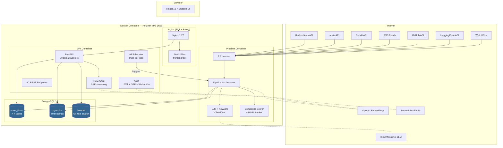
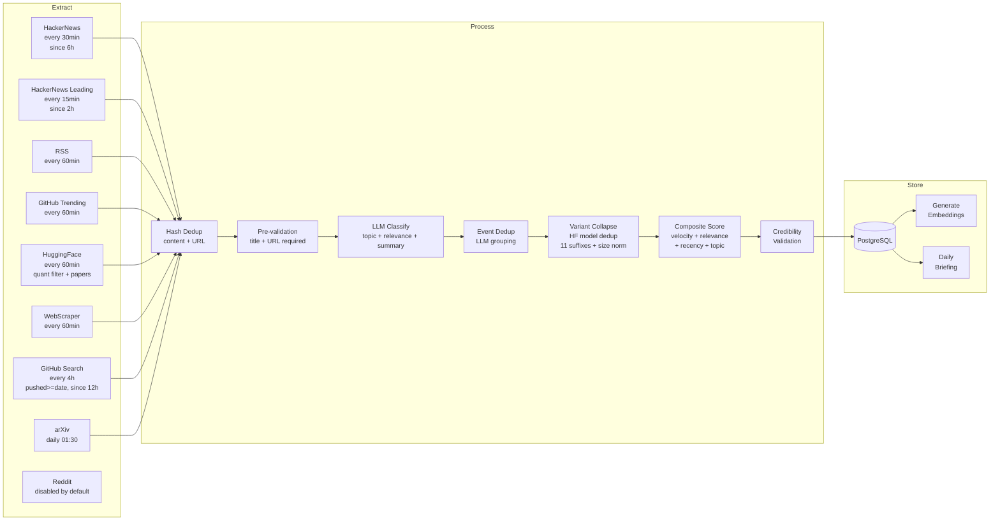
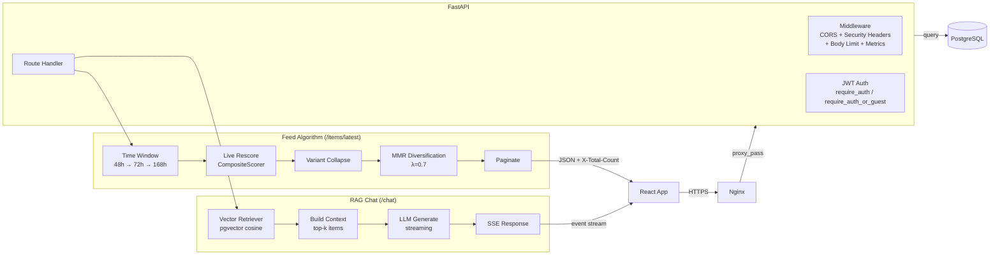
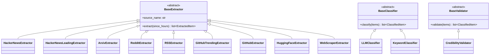
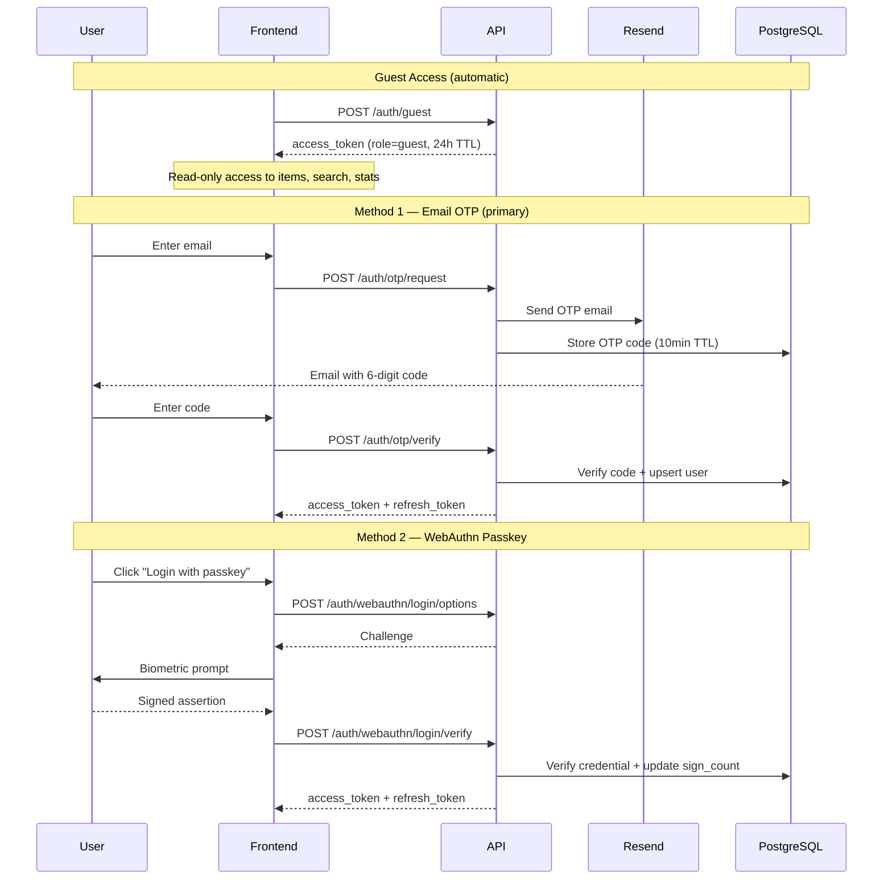
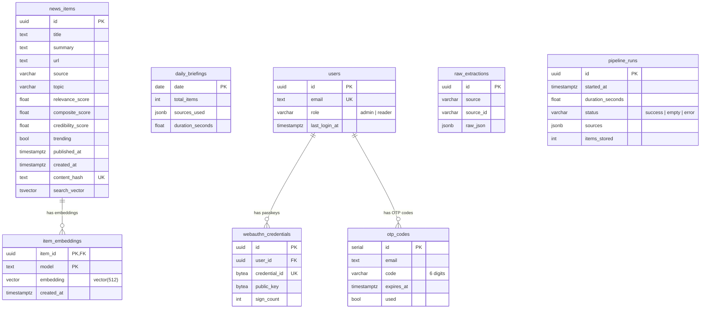
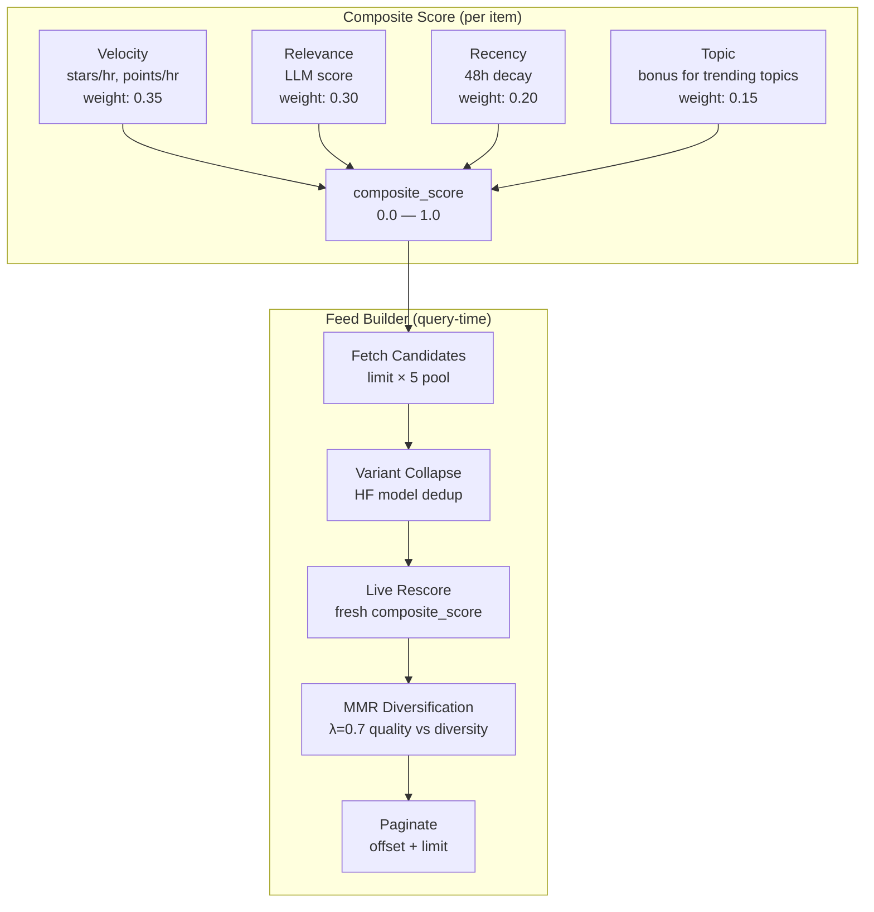
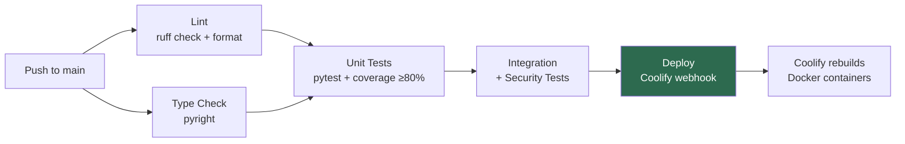

# Architecture Overview

> **Last updated**: 2026-06-13 | **Status**: Production (pguerrero.me)

## System Architecture

AI News Platform runs as a Docker Compose stack on a Hetzner VPS (4GB RAM, ~5 EUR/month).

### Component Resource Budget

| Component | Technology | RAM Budget | Purpose |
|-----------|-----------|-----------|---------|
| Database | PostgreSQL 16 + pgvector | ~300MB | Storage, FTS, vector search |
| API | FastAPI (2 workers) | ~200MB | REST API, scheduler, RAG chat |
| Pipeline | Python (temporal) | ~300MB | News extraction + classification |
| Nginx | Nginx 1.27 | ~50MB | TLS, reverse proxy, static files |
| OS + Docker | Linux | ~400MB | Infrastructure |

## Data Flow — Pipeline

The pipeline runs on a multi-tier schedule (15min / 30min / 60min / 4h / daily) with per-source circuit breakers.

### Pipeline Schedule

| Tier | Sources | Interval | Extraction Window |
|------|---------|----------|-------------------|
| 1 | HackerNews | 30 min | 6 hours |
| 1b | HackerNews Leading | 15 min | 2 hours |
| 2 | RSS, GitHub (trending), HuggingFace, WebScraper | 60 min | 3 hours |
| 2b | GitHub Search | 4 hours (240 min) | 12 hours |
| 3 | arXiv | Daily 01:30 UTC | 24 hours |
| — | OTP cleanup | Daily 02:00 UTC | — |

Reddit is registered but **disabled by default** (not scheduled; `reddit_poll_interval_minutes=15` is defined but unused).

Circuit breaker: 3 consecutive failures → 1 hour cooldown per source.

## Data Flow — API Request

## Interface Architecture

Every major component is defined as an ABC. New implementations extend the system
without modifying existing code (Open/Closed Principle).

## Authentication Flow

Two access tiers: guest tokens for public read-only access, and full auth (OTP + WebAuthn) for protected features.

## Database Schema

### Key Indexes

| Table | Index | Type | Purpose |
|-------|-------|------|---------|
| news_items | content_hash | UNIQUE | Deduplication |
| news_items | search_vector | GIN | Full-text search |
| news_items | effective_date | B-tree DESC | Feed ordering |
| news_items | trending + date | Partial B-tree | Trending queries |
| news_items | composite_score | B-tree | Feed ranking |
| item_embeddings | embedding | HNSW (cosine) | Vector similarity |
| webauthn_credentials | credential_id | UNIQUE | Passkey lookup |

## Security Model

- **Auth**: Guest tokens (public, read-only, 24h TTL) + Passwordless OTP + WebAuthn passkeys → JWT (30min access + 7d refresh with rotation)
- **Access tiers**: Public endpoints use `require_auth_or_guest`, protected endpoints (chat, settings) use `require_auth`
- **SSRF**: All external URL fetches check for private IP ranges
- **Headers**: X-Content-Type-Options, X-Frame-Options, Referrer-Policy, Permissions-Policy, HSTS
- **Body limit**: 1MB max request body (ASGI middleware)
- **Rate limiting**: JWT-aware slowapi — guest by `jti` (30 req/min), user by `sub` (120 req/min), fallback to IP
- **Scanner blocking**: Nginx returns 444 (connection drop) for wp-admin, phpMyAdmin, .env, .git probes
- **Secrets**: `.env` file, never committed, validated at startup (fail-fast on insecure defaults)
- **Scanning**: bandit in CI, ruff security rules (S-series)
- **Network**: Nginx/Traefik TLS termination, HTTPS via Let's Encrypt

## Observability

- **Logging**: structlog JSON with `correlation_id` per pipeline run / API request
- **Metrics**: Prometheus counters and histograms at `/metrics` (localhost only)
  - `api_requests_total`, `api_request_duration_seconds`
  - `pipeline_runs_total`, `pipeline_duration_seconds`
  - Per-extractor duration, items stored, classification duration
  - Embedding failures, validation failures
- **Run tracking**: Per-stage stats (items extracted/deduped/filtered/stored, failures, duration) persisted to the `pipeline_runs` table on every pipeline run; surfaced via the admin API (audit, freshness, pipeline-runs). No push-alert channel — observability is pull-based.

## Feed Algorithm

The feed ranking system replaces simple chronological ordering with quality-aware diversification:

## CI/CD Pipeline

**Kill switch**: `COOLIFY_DEPLOY_ENABLED` GitHub Variable (set to `false` to disable auto-deploy).

---

*See also: [Architecture, File Map & API Reference](agents.md) for the complete file map, endpoint reference, and DB schema details.*
