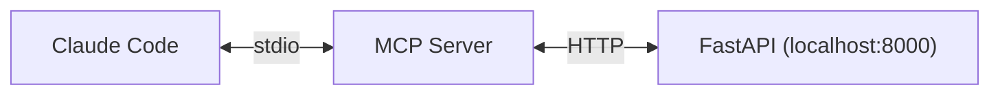

# Milestone 3 Design — New Sources + MCP Server + Polish

**Date**: 2026-02-17
**Status**: Approved
**Depends on**: M2 complete (512 unit tests, 26 E2E tests, 91% coverage)

## Overview

M3 adds two new data sources (GitHub, HuggingFace), an MCP server for AI agent integration, and frontend polish with Highcharts analytics. After M3, the platform has 6 sources, is queryable by AI agents, and has a production-ready UI.

---

## Track A: New Extractors

### GitHub Trending Extractor

**File**: `src/extractors/github.py`

**API**: GitHub Search API (`GET https://api.github.com/search/repositories`)

**Queries**: Configurable via `GITHUB_SEARCH_QUERIES` env var (default: `AI,LLM,machine-learning,generative-AI`)

**Filters**:
- Created or pushed in last 48h
- Stars > 50
- Language in common set (Python, TypeScript, Rust, Go, etc.)

**Auth**: Optional `GITHUB_TOKEN` env var. Without token: 10 req/min. With token: 30 req/min.

**Mapping**:
- `title` = `{repo_name}: {description}`
- `url` = repo HTML URL
- `source` = `"github"`
- `score` = stargazers_count
- `author` = owner login
- `text` = README excerpt (if available from API) or description
- `metadata` = `{"language": ..., "stars": ..., "forks": ..., "topics": [...]}`

**Dedup**: url_hash on repo URL (same repo won't be extracted twice)

**Rate limit handling**: Respect `X-RateLimit-Remaining` header, sleep if near limit.

### HuggingFace Extractor

**File**: `src/extractors/huggingface.py`

**API**: HuggingFace Hub API (`GET https://huggingface.co/api/models`)

**Filters**:
- Sort by `trending` (HF API parameter)
- Updated in last 48h
- Minimum downloads: configurable via `HF_MIN_DOWNLOADS` env var (default: 100)

**Auth**: None required (public API).

**Mapping**:
- `title` = model ID (e.g., `meta-llama/Llama-3-8B`)
- `url` = `https://huggingface.co/{model_id}`
- `source` = `"huggingface"`
- `score` = downloads count
- `author` = model author/org
- `text` = model card excerpt (first 500 chars from model card if available)
- `metadata` = `{"pipeline_tag": ..., "downloads": ..., "likes": ..., "tags": [...]}`

**Dedup**: url_hash on model URL.

### Registration

Both extractors registered in pipeline config. `ENABLED_SOURCES` updated to include `github,huggingface`. `VALID_SOURCES` model constant updated to 8 sources.

---

## Track B: MCP Server

### Architecture



The MCP server is a thin wrapper: it receives tool calls via stdio, translates them to HTTP requests against the existing FastAPI API, and returns formatted results.

### Files

```
src/mcp/
├── __init__.py
├── server.py       # MCP server definition, tool registration, handlers
└── client.py       # APIClient: HTTP calls to FastAPI, JWT management
```

### HTTP Client (`client.py`)

- Uses `httpx` (sync, since MCP stdio is synchronous)
- `MCP_API_BASE_URL` defaults to `http://localhost:8000`
- On init: reads `SHARED_PASSWORD` env var, calls `POST /api/auth/token` to get JWT
- Stores token, includes as `Authorization: Bearer {token}` on all subsequent calls
- No token refresh (tokens last long enough for a session; restart to refresh)

### Tools (`server.py`)

| Tool | Parameters | API Call | Returns |
|------|-----------|----------|---------|
| `search_news` | `query` (required), `topic?`, `date_from?`, `date_to?`, `limit?` | `GET /api/search` | List of items with title, source, topic, summary, url, score |
| `get_latest` | `topic?`, `limit=10` | `GET /api/items/today` | List of today's items |
| `get_trending` | none | `GET /api/items?trending=true` | Trending items only |
| `get_briefing` | `date?` (defaults to today) | `GET /api/briefings/{date}` | Briefing stats + top items |

**Note**: `get_trending` requires adding a `trending` query param filter to `GET /api/items` in the API routes. Minor addition.

**Replaced tool**: The original plan had `get_tech_status(technology)` but this is effectively `search_news(query=technology)`. Replaced with `get_briefing` which provides unique value (pipeline stats + summary).

### Output format

Each tool returns a human-readable text block (not raw JSON). Example for `search_news`:

```
Found 3 results for "LLM fine-tuning":

1. [hackernews] New Fine-tuning Framework Released (150 pts, modelos)
   A revolutionary framework for efficient LLM fine-tuning...
   https://example.com/news/1

2. [arxiv] Paper: Efficient LoRA Variants (papers)
   Comparing LoRA, QLoRA, and DoRA for instruction tuning...
   https://arxiv.org/abs/2402.12345
```

### Claude Code setup

Users configure in `.claude/settings.json` or project MCP config:

```json
{
  "mcpServers": {
    "ainews": {
      "command": "python",
      "args": ["-m", "src.mcp.server"],
      "cwd": "/path/to/ai-news-platform",
      "env": { "SHARED_PASSWORD": "the_password" }
    }
  }
}
```

---

## Track C: Frontend Polish

### Highcharts Analytics Page

**New page**: `web/src/app/pages/analytics.ts` at route `/analytics`

**Dependencies**: `npm install highcharts highcharts-angular`

**3 charts**:

1. **Items per day** (line chart)
   - Last 14 days from `GET /api/briefings` list
   - X-axis: dates, Y-axis: total_items per briefing
   - Shows extraction volume trend

2. **Topic distribution** (pie/donut chart)
   - From today's briefing items
   - Slice per topic with count
   - Replaces the text-only topic chips on dashboard (chips remain, chart adds visual)

3. **Sources breakdown** (bar chart)
   - From today's items grouped by source
   - Colored bars matching source badge colors (orange=HN, red=arxiv, etc.)

**Nav**: New "Analytics" link in navbar between "Buscar" and "Salir".

### API Addition: Trending Filter

Add `trending: bool` optional query param to `GET /api/items` route. Filters `WHERE trending = true`. Used by MCP server's `get_trending` tool.

### Rate Limiting

**Library**: `slowapi` added to pyproject.toml dependencies.

**Limits**:
- `POST /api/auth/token`: 5 requests/minute (brute-force protection)
- `GET /api/*`: 60 requests/minute per IP
- Returns 429 with `Retry-After` header

### CORS

**Middleware**: `CORSMiddleware` in FastAPI app.

**Config**: `CORS_ORIGINS` env var (comma-separated, default: `http://localhost:4200` for dev). In production: the actual domain.

### Responsive Nav

At `max-width: 640px`:
- Hamburger menu button replaces inline nav links
- Click toggles a dropdown menu
- Menu items stack vertically
- Close on navigation or outside click

### Prometheus Metrics

New histogram: `api_request_duration_seconds` with labels `method`, `path`, `status_code`. Added via FastAPI middleware.

---

## Testing

### New Extractor Tests (~100 tests)

- `tests/unit/test_github_extractor.py` (~50 tests): API response mocking, pagination, rate limit headers, optional auth, error handling, dedup, query configuration
- `tests/unit/test_huggingface_extractor.py` (~50 tests): trending sort, downloads filter, model card parsing, error handling, dedup

### MCP Server Tests (~30 tests)

- `tests/unit/test_mcp_server.py` (~15 tests): tool handlers with mocked client, parameter validation, output formatting
- `tests/unit/test_mcp_client.py` (~15 tests): JWT auth flow, API call mapping, error handling, connection failures

### API & Middleware Tests (~10 tests)

- Trending filter on items endpoint
- Rate limiting returns 429
- CORS headers present

### E2E Tests (~5 tests)

- `tests/e2e/test_analytics.py`: charts page renders, 3 charts visible, nav link works, data loads

### Coverage Target

Maintain 80%+ (currently 91%). Estimated total: ~145 new tests, bringing total to ~660+.

---

## Verification Criteria

1. `ENABLED_SOURCES=hackernews,arxiv,reddit,rss,github,huggingface` — 6 sources active
2. `python -m src.mcp.server` starts, responds to tool calls via stdio
3. MCP works in Claude Code: `search_news("latest LLM releases")` returns results
4. Highcharts analytics page renders 3 charts
5. `POST /api/auth/token` rate-limited to 5/min
6. CORS headers present on API responses
7. Mobile nav works at 640px
8. All tests pass, coverage >= 80%
9. Telegram alerts fire on pipeline failures
