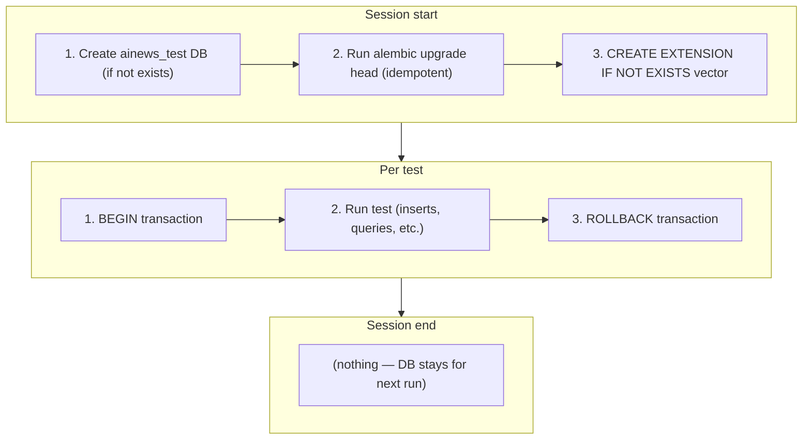

# Milestone 10 — Integration Testing

## Goal

Validate real component interactions against PostgreSQL (pgvector). The unit test
suite (702 tests, 95% coverage) mocks all I/O — integration tests prove the actual
DB queries, transactions, full-text search, and vector similarity work correctly
end-to-end.

This milestone adds ~27 integration tests across 6 files, covering every DB
interaction boundary: pipeline storage, API query routes, RAG embeddings, and auth.

## Decisions

| Decision | Choice | Rationale |
|---|---|---|
| Database | Real PostgreSQL (pgvector:pg16) | Exact production parity — pgvector, GIN indexes, JSONB, plainto_tsquery |
| Test DB | `ainews_test` (separate database) | Already configured in tests/conftest.py settings |
| Isolation | Transaction rollback per test | Fast, no cleanup needed, existing pattern in conftest |
| External APIs | Service-level mocks | Mock `.extract()`, `EmbeddingService`, `ChatService` — not HTTP. Real DB, fake APIs |
| CI | PostgreSQL service in GitHub Actions | Already configured in ci.yml with pgvector:pg16 |
| Marker | `@pytest.mark.integration` | Already declared in pyproject.toml. Run separately from unit tests |
| Timeout | 60s per test | Longer than unit tests (30s) to account for real DB I/O |
| New dependencies | None | All infra already available (asyncpg, pgvector, alembic) |

## Success Criteria

- [x] All 28 integration tests pass (`pytest tests/integration/ -m integration --timeout=60`)
- [x] Tests run against real PostgreSQL with pgvector
- [x] No unit test regressions (702 still pass)
- [x] `ruff check .` clean
- [x] CI pipeline runs integration tests after unit tests
- [x] Every DB interaction in the codebase has at least one integration test

---

## Infrastructure

### `tests/integration/conftest.py`

Fixtures for integration tests:

- **`integration_engine`** — `create_async_engine(settings.database_url)` pointing to `ainews_test`
- **`integration_session`** — Transaction-wrapped `AsyncSession` (rollback after each test)
- **`run_migrations`** — Session-scoped fixture that runs `alembic upgrade head` once at start
- **`seed_items(session)`** — Helper to insert a batch of NewsItems with known data
- **`seed_briefing(session)`** — Helper to insert a DailyBriefing
- **`seed_embeddings(session, items)`** — Helper to insert ItemEmbeddings with fake vectors
- **`auth_token`** — JWT from POST /api/auth/login for protected route tests
- **`client(session)`** — AsyncClient with FastAPI app, session dependency overridden

### Database Lifecycle

### CI Integration

Extend `.github/workflows/ci.yml`:
- After unit tests, run: `pytest tests/integration/ -m integration --timeout=60`
- PostgreSQL service already configured with pgvector:pg16

---

## Components

### 1. Pipeline E2E (`tests/integration/test_pipeline.py`) — 7 tests

| Test | Scenario | Expected |
|---|---|---|
| `test_pipeline_stores_items_in_db` | Mock extractors return 5 items → run pipeline → query DB | 5 NewsItem rows with correct fields |
| `test_pipeline_dedup_by_content_hash` | Extractors return items with duplicate content_hash | Only unique rows stored (ON CONFLICT DO NOTHING) |
| `test_pipeline_briefing_created` | Run pipeline with 5 items | DailyBriefing row with items_extracted=5, correct date |
| `test_pipeline_briefing_accumulates` | Run pipeline twice (3 + 2 items) | Single briefing row, total_items=5 |
| `test_pipeline_batch_commit` | 30 items (exceeds BATCH_COMMIT_SIZE=25) | All 30 stored across 2 batches |
| `test_pipeline_stores_correct_fields` | Item with all fields populated | NewsItem.topic, scores, metadata JSONB all match |
| `test_pipeline_empty_extractors` | All extractors return [] | Pipeline completes, briefing with 0 items |

### 2. API — Items (`tests/integration/test_api_items.py`) — 7 tests

| Test | Scenario | Expected |
|---|---|---|
| `test_list_items_returns_seeded_data` | Seed 5 items → GET /api/items | 200, 5 items in response |
| `test_filter_by_topic` | Seed modelos + herramientas → `?topic=modelos` | Only modelos items |
| `test_filter_by_source` | Seed hackernews + arxiv → `?source=hackernews` | Only hackernews items |
| `test_filter_by_date_range` | Seed items across 3 dates → date_from/date_to | Only items in window |
| `test_pagination` | Seed 10 items → limit=3, offset=0, then offset=3 | Correct slices, order preserved |
| `test_items_count` | Seed N items with filters → GET /api/items/count | Correct count |
| `test_items_today` | Seed today + yesterday items → GET /api/items/today | Only today's items |

### 3. API — Search (`tests/integration/test_api_search.py`) — 3 tests

| Test | Scenario | Expected |
|---|---|---|
| `test_search_finds_matching_items` | Seed "transformer model" item → `?q=transformer` | Item found via plainto_tsquery |
| `test_search_ranks_by_relevance` | Seed items with varying keyword density | ts_rank ordering correct |
| `test_search_with_topic_filter` | Search + `?topic=modelos` | Intersection of FTS + topic filter |

### 4. API — Briefings (`tests/integration/test_api_briefings.py`) — 2 tests

| Test | Scenario | Expected |
|---|---|---|
| `test_list_briefings` | Seed 3 briefings → GET /api/briefings | 3 briefings in response |
| `test_get_briefing_by_date` | Seed briefing + items for date → GET /api/briefings/{date} | Briefing with items included |

### 5. API — Auth (`tests/integration/test_api_auth.py`) — 3 tests

| Test | Scenario | Expected |
|---|---|---|
| `test_login_returns_jwt` | POST /api/auth/login with correct password | 200, response has `access_token` |
| `test_protected_route_with_jwt` | Login → GET /api/items with Bearer token | 200 |
| `test_protected_route_without_jwt` | GET /api/items, no Authorization header | 401 or 403 |

### 6. RAG (`tests/integration/test_rag.py`) — 5 tests

| Test | Scenario | Expected |
|---|---|---|
| `test_store_and_retrieve_embeddings` | Insert items + fake 1536-dim vectors → retrieve by similarity | Correct items ranked by cosine distance |
| `test_retrieve_with_topic_filter` | Embeddings for modelos + herramientas → retrieve with topic=modelos | Only modelos items |
| `test_retrieve_no_embeddings` | Empty item_embeddings table → retrieve | Empty list |
| `test_embed_new_items` | Seed items without embeddings → mock EmbeddingService → run _embed_new_items | Rows in item_embeddings for each item |
| `test_chat_stream_returns_sse` | Seed items + embeddings → mock LLM stream → chat_stream() | Valid SSE events: tokens + sources + [DONE] |

---

## File Map

| File | Tests | What it covers |
|---|---|---|
| `tests/integration/conftest.py` | — | Fixtures, helpers, DB lifecycle |
| `tests/integration/test_pipeline.py` | 7 | Pipeline → DB storage |
| `tests/integration/test_api_items.py` | 7 | Items API → DB queries |
| `tests/integration/test_api_search.py` | 3 | Search API → FTS (plainto_tsquery + GIN) |
| `tests/integration/test_api_briefings.py` | 2 | Briefings API → DB queries |
| `tests/integration/test_api_auth.py` | 3 | Auth flow → JWT → protected routes |
| `tests/integration/test_rag.py` | 5 | Embeddings + retrieval → pgvector |
| **Total** | **27** | |

## Implementation Notes

- **Fixtures reuse**: Extend existing `tests/conftest.py` patterns (engine, session, client)
- **Seed helpers**: Create reusable `seed_items()`, `seed_briefing()`, `seed_embeddings()` in conftest
- **Mocking**: `unittest.mock.patch` for extractors, EmbeddingService, LLM. No respx needed.
- **Commit strategy**: One commit per test file (infra first, then pipeline, API, RAG)
- **pgvector vectors**: Use deterministic fake vectors (e.g., `[0.1]*1536`) for reproducible similarity tests

## Verification

1. `pytest tests/integration/ -m integration --timeout=60` — all pass
2. `pytest tests/unit/ -x --timeout=30` — no regressions (702 still pass)
3. `ruff check . && ruff format --check .`
4. CI green with both unit + integration steps

---

## Next Milestones (Outline)

### M11 — Security Hardening

Penetration-style tests: JWT manipulation (algorithm confusion, forged tokens), SSRF
bypass attempts (DNS rebinding, IPv6 mapped addresses, URL encoding tricks), SQL
injection via search/filter parameters, rate limit evasion, input fuzzing on all API
endpoints, header injection. Validates the "secure by default" principle holds under
adversarial inputs.
