# Milestone 13 — Historical Backfill (2023–now)

## Goal

Build a curated dataset of ~15K–20K AI/agentic AI news items from 2023 to present,
extracted from HackerNews, GitHub, and HuggingFace. Preserve raw API responses for
future reprocessing. Cost-conscious with budget caps and dry-run mode.

## Current State

- Pipeline runs daily at 8 UTC, fetching last 24h from 6 sources
- No historical data — DB starts empty on first deploy
- Extractors fetch only first page (no pagination) — miss 95%+ of available data
- Dedup is batch-only (in-memory), not checked against DB
- No raw data preservation — only processed NewsItem records

## Decisions

| Decision | Choice | Rationale |
|----------|--------|-----------|
| Sources for backfill | HN + GitHub + HuggingFace | Only ones with historical API access |
| Reddit, arXiv, RSS | Skip (daily pipeline fills them) | No historical API / short archives |
| Volume | ~15K–20K curated items | Quality over quantity; HN >50pts, GH >200 stars |
| Cost control | `--dry-run`, `--max-cost`, `--max-items` | Prevent runaway spend |
| Raw data | New `raw_extractions` table (JSONB) | Preserve for future reprocessing without re-extraction |
| Pre-filter | KeywordClassifier before LLM | Reduces LLM calls ~50–60%, saves cost |
| Checkpoints | JSON file, resumable | Handle interruptions, API failures |
| Embeddings | Separate post-backfill step | Decouple from main backfill; can run independently |
| Briefings | Generate retroactively after backfill | Archive page shows items directly; briefings optional |
| LLM model | kimi-latest-8k (Moonshot) | Already configured; $0.20/1M input, $2.00/1M output |
| Embedding model | text-embedding-3-small (OpenAI) | Already configured; $0.02/1M tokens |

## Cost Estimate

| Step | Items | Cost | Notes |
|------|-------|------|-------|
| Extraction (3 APIs) | ~40K raw | $0 | All free APIs |
| Raw storage (JSONB) | ~40K | $0 | ~15MB in PostgreSQL |
| Keyword pre-filter | ~40K → ~16K | $0 | Local regex, no API |
| Quality filter | ~16K → ~15K | $0 | Points/stars threshold |
| LLM classification | ~15K | ~$3 | 1,500 calls × 10 items/batch |
| Embeddings | ~15K | ~$0.30 | 150 calls × 100 items/batch |
| **Total** | | **~$3.30** | |

## Components

### 1. Database: `raw_extractions` Table

New Alembic migration adding:

| Column | Type | Notes |
|--------|------|-------|
| `id` | UUID | PK, default uuid4 |
| `source` | VARCHAR(50) | "hackernews", "github", "huggingface" |
| `source_id` | VARCHAR(255) | Native ID (HN item ID, GH repo full_name, HF model_id) |
| `raw_json` | JSONB | Complete API response for this item |
| `extracted_at` | TIMESTAMP | When we fetched it |
| `backfill_batch` | VARCHAR(50) | Traceability ("2024-Q1", "2023-H2") |

Constraints: `UNIQUE(source, source_id)` — idempotent re-runs.

### 2. Backfill Script: `scripts/backfill.py`

CLI interface:

```
python scripts/backfill.py \
  --sources hackernews,github,huggingface \
  --from 2023-01 \
  --to 2025-02 \
  --max-items 20000 \
  --max-cost 10 \
  --batch-size 200 \
  --dry-run
```

Parameters:

| Param | Default | Description |
|-------|---------|-------------|
| `--sources` | `hackernews,github,huggingface` | Comma-separated sources |
| `--from` | `2023-01` | Start month (inclusive) |
| `--to` | current month | End month (inclusive) |
| `--max-items` | 20,000 | Hard cap on items to process |
| `--max-cost` | 10 | Budget cap in USD (stops at 80% warning, 100% halt) |
| `--batch-size` | 200 | Items per processing batch |
| `--dry-run` | false | Extract + filter only, show cost estimate, no LLM calls |
| `--resume` | false | Continue from last checkpoint |
| `--skip-embeddings` | false | Skip embedding generation (run separately later) |
| `--min-points` | 50 | HN minimum points (default higher than daily pipeline's 10) |
| `--min-stars` | 200 | GitHub minimum stars (default higher than daily pipeline's 50) |

### 3. Backfill Flow

```mermaid
flowchart TD
    P1["Phase 1 — Extract & Store Raw (no cost)"]
    P1a["For each source"]
    P1b["Iterate month by month (from → to)"]
    P1c["Paginate through all API results"]
    P1d["Store each item in raw_extractions (JSONB)"]
    P1e["Save checkpoint (last month + page completed)"]
    P1 --> P1a --> P1b --> P1c --> P1d --> P1e

    P2["Phase 2 — Filter & Classify ($3 LLM cost)"]
    P2a["Load raw_extractions not yet in news_items"]
    P2b["Dedup: check content_hash against existing news_items"]
    P2c["Keyword pre-filter (KeywordClassifier, local, free)"]
    P2d["Quality filter (points/stars thresholds)"]
    P2e["LLM classification in batches of 10"]
    P2f["Store classified items in news_items"]
    P2g["Save checkpoint after each batch"]
    P2 --> P2a --> P2b --> P2c --> P2d --> P2e --> P2f --> P2g

    P3["Phase 3 — Embeddings ($0.30)"]
    P3a["Find news_items without embeddings"]
    P3b["Generate in batches of 100"]
    P3c["Store in item_embeddings"]
    P3 --> P3a --> P3b --> P3c

    P4["Phase 4 — Briefings (optional, no cost)"]
    P4a["Generate DailyBriefing records for dates with items"]
    P4 --> P4a

    P1e --> P2
    P2g --> P3
    P3c --> P4
```



Phases are independent — can run separately, resume after interruption.

### 4. Source-Specific Extraction

**HackerNews (Algolia Search API)**

- Endpoint: `https://hn.algolia.com/api/v1/search`
- Iterate: month by month, 26 months (2023-01 → 2025-02)
- Per month: 6 search queries (from `HN_SEARCH_QUERIES` config)
- Pagination: loop `page=0` to `nbPages`, `hitsPerPage=50`
- Filter: `points > 50`, `tags=story`
- Throttle: 1 request/second (courtesy, no hard limit)
- Dedup: by HN `objectID` within extraction
- Expected: ~15K–20K raw items, ~8K–10K after quality filter

**GitHub (Search API)**

- Endpoint: `https://api.github.com/search/repositories`
- Iterate: month by month, 4 queries per month
- Pagination: loop `page=1` to max 10 (1000 results/query hard limit)
- Filter: `stars > 200`, `pushed:YYYY-MM-DD..YYYY-MM-DD`
- Throttle: 2s between requests (30 req/min with token)
- Dedup: by `full_name` (owner/repo)
- Expected: ~4K raw items, ~3K after quality filter

**HuggingFace (Models API)**

- Endpoint: `https://huggingface.co/api/models`
- Strategy: fetch top 2,000 models sorted by downloads
- Pagination: `limit=100`, iterate with offset
- Filter: `lastModified > 2023-01-01`, `downloads > 100`
- Throttle: 1 request/second
- Dedup: by `modelId`
- Expected: ~2K raw items, ~1.5K after keyword filter

### 5. Cost Safety

**Three-level protection:**

1. **`--dry-run`**: Runs Phase 1 (extract raw) + shows filter stats + estimated LLM cost.
   No LLM calls. Run this first ALWAYS.

2. **`--max-cost N`** (default $10): Tracks token usage in real-time.
   - At 80%: prints warning, continues
   - At 100%: saves checkpoint, stops gracefully
   - Calculation: `(input_tokens × $0.20 + output_tokens × $2.00) / 1_000_000`

3. **`--max-items N`** (default 20,000): Hard cap regardless of cost.

**API error handling:**
- HTTP 402 (no balance): save checkpoint, stop, print "top up API balance"
- HTTP 429 (rate limit): wait `Retry-After` header, retry 3×, then checkpoint+stop
- HTTP 5xx: exponential backoff (2s, 4s, 8s), retry 3×, then skip item and continue

**Checkpoint file** (`data/backfill-checkpoint.json`):
```json
{
  "phase": "extract",
  "sources": {
    "hackernews": {"last_month": "2024-06", "last_page": 12, "items_stored": 8500},
    "github": {"last_month": "2024-03", "last_page": 5, "items_stored": 2100},
    "huggingface": {"offset": 800, "items_stored": 800}
  },
  "classify": {"last_raw_id": "uuid-here", "items_classified": 5200},
  "cost_usd": 1.85,
  "updated_at": "2025-02-21T10:30:00Z"
}
```

### 6. Quality Filters

Applied BEFORE LLM classification (free):

| Filter | Purpose | Implementation |
|--------|---------|----------------|
| Keyword pre-filter | Remove non-AI items | Existing `KeywordClassifier` with 0.3 threshold (lenient) |
| HN points ≥ 50 | Quality signal | Algolia `numericFilters` |
| GitHub stars ≥ 200 | Quality signal | Search API `stars:>200` |
| HF downloads ≥ 100 | Quality signal | API param + code filter |
| Content hash dedup | Avoid reprocessing | Check against existing `news_items.content_hash` |

### 7. Data Reuse

The `raw_extractions` table enables future projects:

- **Export**: `scripts/export_raw.py --format jsonl --source hackernews --output data/hn-2023-2025.jsonl`
- **Reprocess**: Run new classifiers/models on raw data without re-extracting
- **Analytics**: Query raw JSONB for source-specific fields (HN points over time, GH star trends)
- **Fine-tuning**: Use classified items as training data for custom models
- **Parquet export**: For data science workflows with pandas/polars

## Test Plan (~8 tests)

| File | Tests | What |
|------|-------|------|
| `tests/unit/test_backfill.py` | 3 | Checkpoint save/load, cost tracker, dry-run output |
| `tests/unit/test_raw_extractions.py` | 2 | Raw insert idempotent, JSONB query |
| `tests/integration/test_backfill_hn.py` | 3 | HN pagination mock, quality filter, end-to-end small batch |

## Success Criteria

- [x] `raw_extractions` table created via Alembic migration
- [x] `--dry-run` shows accurate extraction counts and cost estimate
- [ ] Backfill completes for all 3 sources with checkpoints (run manually)
- [ ] ~15K–20K curated items in `news_items` (run manually)
- [ ] ~40K raw records in `raw_extractions` (run manually)
- [ ] Embeddings generated for all backfilled items (run manually)
- [x] Cost stayed within `--max-cost` budget (CostTracker implemented)
- [x] All new tests pass (12 new: 6 unit infra + 4 unit extractors + 2 integration)
- [x] No regressions on existing test suites (1 pre-existing env-leak failure)
- [x] `ruff check .` clean

## Files to Create/Modify

| File | Change |
|------|--------|
| `alembic/versions/003_raw_extractions.py` | New migration — raw_extractions table |
| `src/core/models.py` | Add RawExtraction model |
| `scripts/backfill.py` | New — main backfill CLI script |
| `scripts/export_raw.py` | New — export raw data to JSONL/Parquet |
| `src/pipeline/backfill/` | New package — extraction, filtering, checkpoint logic |
| `src/pipeline/backfill/__init__.py` | Package init |
| `src/pipeline/backfill/extractors.py` | Historical extractors with pagination |
| `src/pipeline/backfill/filters.py` | Quality + keyword pre-filters |
| `src/pipeline/backfill/checkpoint.py` | Checkpoint save/load/resume |
| `src/pipeline/backfill/cost_tracker.py` | Real-time cost tracking |
| `tests/unit/test_backfill.py` | Unit tests for checkpoint, cost, dry-run |
| `tests/unit/test_raw_extractions.py` | Unit tests for raw storage |
| `tests/integration/test_backfill_hn.py` | Integration test with mocked HN API |
