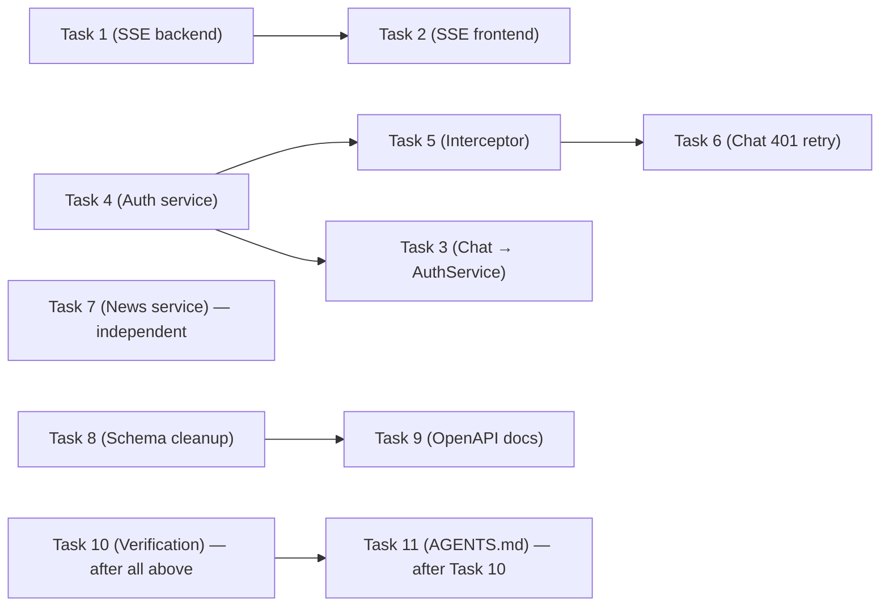

# M15: API Contract Polish — Implementation Plan

> **For Claude:** REQUIRED SUB-SKILL: Use superpowers:executing-plans to implement this plan task-by-task.

**Goal:** Improve SSE chat contract (OpenAI-style events + message ID), integrate refresh tokens in the Angular frontend, update services for M14 features, and clean up schemas/OpenAPI docs.

**Architecture:** Backend changes are minimal (chat SSE format, schema cleanup). Most work is in the Angular frontend: auth service, interceptor, news service, chat page. Python tests validate the new SSE format. Angular has no unit tests (only Playwright E2E).

**Tech Stack:** Python 3.12, FastAPI, Angular 21, TypeScript, SCSS, pytest, Playwright.

**Key files reference:**
- Chat backend: `src/rag/chat.py`
- Chat route: `src/api/routes/chat.py`
- Schemas: `src/api/schemas.py`
- All routes: `src/api/routes/{items,search,briefings,chat,auth,stats,topics}.py`
- Angular auth: `web/src/app/services/auth.service.ts`
- Angular interceptor: `web/src/app/interceptors/auth.interceptor.ts`
- Angular news service: `web/src/app/services/news.service.ts`
- Angular models: `web/src/app/models/news-item.ts`
- Angular chat page: `web/src/app/pages/chat.ts`
- Unit tests: `tests/unit/test_chat_service.py`, `tests/unit/test_chat_route.py`

**How to run tests:**
```bash
cd /home/paul/Documentos/proyectos/backend/ai-news-platform
# Python unit tests:
.venv/bin/pytest tests/unit/ -x -v --timeout=30
# Angular build check:
cd web && npx ng build --configuration=development
# Angular E2E (requires built app):
cd .. && .venv/bin/pytest tests/e2e/ -x -v
```

---

### Task 1: Chat SSE — new event format in backend

**Files:**
- Modify: `src/rag/chat.py`
- Test: `tests/unit/test_chat_service.py`

**Step 1: Update tests to expect new SSE format**

In `tests/unit/test_chat_service.py`, update `TestChatStream` tests. The new format uses:
- `event: message\ndata: {"id":"msg_xxx","type":"token","content":"..."}\n\n`
- `event: message\ndata: {"id":"msg_xxx","type":"sources","content":[...]}\n\n`
- `event: error\ndata: {"id":"msg_xxx","error":{"code":"...","message":"..."}}\n\n`
- `event: done\ndata: {"id":"msg_xxx"}\n\n`

Update `test_yields_token_events` to check for `event: message\n` prefix and JSON with `id`, `type`, `content` fields. Update `test_empty_question_yields_error` and `test_llm_error_yields_error_event` to check for `event: error\n` prefix. Update `test_no_results_still_streams` to check for `event: done\n` instead of `data: [DONE]`.

**Step 2: Run tests to verify they fail**

Run: `.venv/bin/pytest tests/unit/test_chat_service.py -x -v --timeout=30`
Expected: FAIL (old format doesn't match new assertions)

**Step 3: Implement new SSE format in chat.py**

In `src/rag/chat.py`, update `ChatService.chat_stream()`:

1. At the top of `chat_stream`, generate message ID: `msg_id = f"msg_{uuid.uuid4().hex[:12]}"`
2. Add import: `import uuid`
3. Create helper method `_sse_event(event_type: str, data: dict) -> str` that returns `f"event: {event_type}\ndata: {json.dumps(data)}\n\n"`
4. Replace all `yield f"data: ..."` with calls to the helper:
   - Tokens: `self._sse_event("message", {"id": msg_id, "type": "token", "content": content})`
   - Sources: `self._sse_event("message", {"id": msg_id, "type": "sources", "content": sources})`
   - Errors: `self._sse_event("error", {"id": msg_id, "error": {"code": "...", "message": "..."}})`
   - Done: `self._sse_event("done", {"id": msg_id})`
5. Remove the `data: [DONE]` line — replaced by `event: done`

**Step 4: Run tests to verify they pass**

Run: `.venv/bin/pytest tests/unit/test_chat_service.py -x -v --timeout=30`
Expected: PASS

**Step 5: Run full test suite**

Run: `.venv/bin/pytest tests/unit/ -x --timeout=30 -q`
Expected: All pass

**Step 6: Commit**

```bash
git add src/rag/chat.py tests/unit/test_chat_service.py
git commit -m "feat: M15 chat SSE OpenAI-style events with message ID [Track A]"
```

---

### Task 2: Chat frontend — update SSE parser

**Files:**
- Modify: `web/src/app/pages/chat.ts`

**Step 1: Update the SSE parser in chat.ts**

In the `onSend()` method, replace the current parser that looks for `data:` lines with one that handles `event:` + `data:` pairs:

1. Track current event type with a variable `let currentEvent = ''`
2. When parsing lines:
   - If line starts with `event: `, set `currentEvent = line.slice(7)`
   - If line starts with `data: `, parse the JSON data
   - Use `currentEvent` to route: `message` → check `parsed.type` (token/sources), `error` → show error, `done` → finish
3. Error handling: if `parsed.error`, show `parsed.error.message` (not the raw object)
4. Remove the `data === '[DONE]'` check — replaced by `event: done`

**Step 2: Build Angular to verify no TS errors**

Run: `cd web && npx ng build --configuration=development`
Expected: BUILD SUCCESS

**Step 3: Commit**

```bash
git add web/src/app/pages/chat.ts
git commit -m "feat: M15 chat frontend — parse OpenAI-style SSE events [Track A]"
```

---

### Task 3: Chat fetch → AuthService

**Files:**
- Modify: `web/src/app/pages/chat.ts`

**Step 1: Replace direct localStorage access with AuthService**

In `chat.ts`, the `onSend()` method currently does:
```typescript
const token = this.auth.getToken();
```

This already uses `AuthService.getToken()` — no change needed here. However, the `fetch()` call constructs the header manually. This is fine since SSE can't use HttpClient. Verify that `this.auth` is already injected (it is: `private auth = inject(AuthService)`).

**The actual change:** When fetch returns 401, attempt refresh before showing error:

```typescript
if (!response.ok) {
  if (response.status === 401) {
    const refreshed = await this.auth.refreshToken();
    if (refreshed) {
      // retry with new token
      return this.onSend();  // re-queue question was already cleared, need to handle
    }
  }
  throw new Error(`HTTP ${response.status}`);
}
```

**Note:** This task depends on Task 4 (auth.service refresh method). Defer the 401 retry logic to after Task 4 is complete. For now, just ensure the token comes from AuthService (already does).

**Step 2: Verify build**

Run: `cd web && npx ng build --configuration=development`
Expected: BUILD SUCCESS

**Step 3: Commit** (will be combined with Task 4)

---

### Task 4: Auth service — refresh tokens

**Files:**
- Modify: `web/src/app/services/auth.service.ts`

**Step 1: Update auth.service.ts**

Replace the current auth service with one that handles `TokenResponseV2`:

```typescript
import { Injectable, inject } from '@angular/core';
import { HttpClient } from '@angular/common/http';
import { Observable, tap, firstValueFrom } from 'rxjs';

interface TokenResponseV2 {
  access_token: string;
  refresh_token: string;
  expires_in: number;
  token_type: string;
}

@Injectable({ providedIn: 'root' })
export class AuthService {
  private http = inject(HttpClient);
  private tokenKey = 'ainews_token';
  private refreshKey = 'ainews_refresh_token';
  private expiryKey = 'ainews_token_expiry';

  login(password: string): Observable<TokenResponseV2> {
    return this.http
      .post<TokenResponseV2>('/api/auth/token', { password })
      .pipe(tap((res) => this.storeTokens(res)));
  }

  async refreshToken(): Promise<boolean> {
    const refreshToken = localStorage.getItem(this.refreshKey);
    if (!refreshToken) return false;

    try {
      const res = await firstValueFrom(
        this.http.post<TokenResponseV2>('/api/auth/refresh', {
          refresh_token: refreshToken,
        })
      );
      this.storeTokens(res);
      return true;
    } catch {
      this.logout();
      return false;
    }
  }

  logout(): void {
    localStorage.removeItem(this.tokenKey);
    localStorage.removeItem(this.refreshKey);
    localStorage.removeItem(this.expiryKey);
  }

  getToken(): string | null {
    return localStorage.getItem(this.tokenKey);
  }

  isAuthenticated(): boolean {
    const token = this.getToken();
    if (!token) return false;
    const expiry = localStorage.getItem(this.expiryKey);
    if (expiry) {
      return parseInt(expiry, 10) > Date.now();
    }
    // Fallback: decode JWT exp
    try {
      const payload = JSON.parse(atob(token.split('.')[1]));
      return payload.exp * 1000 > Date.now();
    } catch {
      return false;
    }
  }

  private storeTokens(res: TokenResponseV2): void {
    localStorage.setItem(this.tokenKey, res.access_token);
    localStorage.setItem(this.refreshKey, res.refresh_token);
    localStorage.setItem(
      this.expiryKey,
      (Date.now() + res.expires_in * 1000).toString()
    );
  }
}
```

**Step 2: Verify build**

Run: `cd web && npx ng build --configuration=development`
Expected: BUILD SUCCESS

**Step 3: Commit**

```bash
git add web/src/app/services/auth.service.ts
git commit -m "feat: M15 auth service — refresh tokens, expiry tracking [Track B]"
```

---

### Task 5: Auth interceptor — auto-refresh on 401

**Files:**
- Modify: `web/src/app/interceptors/auth.interceptor.ts`

**Step 1: Update auth interceptor**

Replace the current interceptor with one that attempts refresh on 401:

```typescript
import { inject } from '@angular/core';
import { HttpInterceptorFn, HttpErrorResponse } from '@angular/common/http';
import { Router } from '@angular/router';
import { catchError, switchMap, throwError, from } from 'rxjs';
import { AuthService } from '../services/auth.service';

export const authInterceptor: HttpInterceptorFn = (req, next) => {
  const auth = inject(AuthService);
  const router = inject(Router);
  const token = auth.getToken();

  if (token && !req.url.includes('/api/auth/')) {
    req = req.clone({ setHeaders: { Authorization: `Bearer ${token}` } });
  }

  return next(req).pipe(
    catchError((err: HttpErrorResponse) => {
      if (err.status === 401 && !req.url.includes('/api/auth/')) {
        return from(auth.refreshToken()).pipe(
          switchMap((refreshed) => {
            if (refreshed) {
              const newToken = auth.getToken();
              const retryReq = req.clone({
                setHeaders: { Authorization: `Bearer ${newToken}` },
              });
              return next(retryReq);
            }
            auth.logout();
            router.navigate(['/login']);
            return throwError(() => err);
          })
        );
      }
      if (err.status === 403) {
        auth.logout();
        router.navigate(['/login']);
      }
      return throwError(() => err);
    })
  );
};
```

Key changes:
- On 401: attempt `auth.refreshToken()` (async, wrapped in `from()`)
- If refresh succeeds: retry original request with new token
- If refresh fails: logout + redirect to login
- Skip refresh for `/api/auth/*` URLs to avoid infinite loops
- 403 still forces logout immediately

**Step 2: Verify build**

Run: `cd web && npx ng build --configuration=development`
Expected: BUILD SUCCESS

**Step 3: Commit**

```bash
git add web/src/app/interceptors/auth.interceptor.ts
git commit -m "feat: M15 auth interceptor — auto-refresh on 401 [Track B]"
```

---

### Task 6: Chat page — 401 retry with refresh

**Files:**
- Modify: `web/src/app/pages/chat.ts`

**Step 1: Add 401 retry logic to chat fetch**

Since chat uses raw `fetch()` (not HttpClient), it doesn't benefit from the interceptor. Add retry logic in `onSend()`:

In the `try` block, after `const response = await fetch(...)`:

```typescript
if (!response.ok) {
  if (response.status === 401) {
    const refreshed = await this.auth.refreshToken();
    if (refreshed) {
      // Retry with new token — re-set question and recurse
      this.question = q;
      this.messages.update(msgs => msgs.slice(0, -1)); // remove the user message we just added
      this.streaming.set(false);
      return this.onSend();
    }
  }
  throw new Error(`HTTP ${response.status}`);
}
```

**Step 2: Verify build**

Run: `cd web && npx ng build --configuration=development`
Expected: BUILD SUCCESS

**Step 3: Commit**

```bash
git add web/src/app/pages/chat.ts
git commit -m "feat: M15 chat page — 401 retry with token refresh [Track B]"
```

---

### Task 7: Frontend news service — pagination + stats

**Files:**
- Modify: `web/src/app/models/news-item.ts`
- Modify: `web/src/app/services/news.service.ts`

**Step 1: Add PaginatedResponse and stats interfaces to models**

In `web/src/app/models/news-item.ts`, add:

```typescript
export interface PaginatedResponse<T> {
  items: T[];
  totalCount: number;
}

export interface StatsSummary {
  total_items: number;
  items_today: number;
  sources_count: number;
  topics_count: number;
  trending_today: number;
}

export interface StatsGroup {
  name: string;
  count: number;
}

export interface StatsDate {
  date: string;
  count: number;
}
```

**Step 2: Update news.service.ts**

Add offset/sort_by params to existing methods. Add stats methods. Add `observe: 'response'` to read X-Total-Count header on paginated endpoints:

```typescript
import { Injectable, inject } from '@angular/core';
import { HttpClient, HttpParams } from '@angular/common/http';
import { Observable, map } from 'rxjs';
import {
  NewsItem,
  Briefing,
  PaginatedResponse,
  StatsSummary,
  StatsGroup,
  StatsDate,
} from '../models/news-item';

@Injectable({ providedIn: 'root' })
export class NewsService {
  private http = inject(HttpClient);
  private baseUrl = '/api';

  getTodayItems(params?: {
    limit?: number;
    offset?: number;
    topic?: string;
  }): Observable<PaginatedResponse<NewsItem>> {
    let httpParams = new HttpParams();
    if (params?.limit) httpParams = httpParams.set('limit', params.limit);
    if (params?.offset) httpParams = httpParams.set('offset', params.offset);
    if (params?.topic) httpParams = httpParams.set('topic', params.topic);
    return this.http
      .get<NewsItem[]>(`${this.baseUrl}/items/today`, {
        params: httpParams,
        observe: 'response',
      })
      .pipe(
        map((res) => ({
          items: res.body ?? [],
          totalCount: parseInt(res.headers.get('X-Total-Count') ?? '0', 10),
        }))
      );
  }

  getItems(params?: {
    source?: string;
    topic?: string;
    date_from?: string;
    date_to?: string;
    limit?: number;
    offset?: number;
  }): Observable<PaginatedResponse<NewsItem>> {
    let httpParams = new HttpParams();
    if (params) {
      Object.entries(params).forEach(([key, value]) => {
        if (value !== undefined && value !== null) {
          httpParams = httpParams.set(key, value.toString());
        }
      });
    }
    return this.http
      .get<NewsItem[]>(`${this.baseUrl}/items`, {
        params: httpParams,
        observe: 'response',
      })
      .pipe(
        map((res) => ({
          items: res.body ?? [],
          totalCount: parseInt(res.headers.get('X-Total-Count') ?? '0', 10),
        }))
      );
  }

  getBriefing(date: string): Observable<Briefing> {
    return this.http.get<Briefing>(`${this.baseUrl}/briefings/${date}`);
  }

  getBriefings(params?: {
    limit?: number;
    offset?: number;
  }): Observable<PaginatedResponse<Briefing>> {
    let httpParams = new HttpParams();
    if (params?.limit) httpParams = httpParams.set('limit', params.limit);
    if (params?.offset) httpParams = httpParams.set('offset', params.offset);
    return this.http
      .get<Briefing[]>(`${this.baseUrl}/briefings`, {
        params: httpParams,
        observe: 'response',
      })
      .pipe(
        map((res) => ({
          items: res.body ?? [],
          totalCount: parseInt(res.headers.get('X-Total-Count') ?? '0', 10),
        }))
      );
  }

  getTopics(): Observable<string[]> {
    return this.http
      .get<{ topics: string[] }>(`${this.baseUrl}/topics`)
      .pipe(map((response) => response.topics));
  }

  searchItems(params: {
    q: string;
    topic?: string;
    date_from?: string;
    date_to?: string;
    sort_by?: string;
    limit?: number;
    offset?: number;
  }): Observable<PaginatedResponse<NewsItem>> {
    let httpParams = new HttpParams().set('q', params.q);
    if (params.topic) httpParams = httpParams.set('topic', params.topic);
    if (params.date_from) httpParams = httpParams.set('date_from', params.date_from);
    if (params.date_to) httpParams = httpParams.set('date_to', params.date_to);
    if (params.sort_by) httpParams = httpParams.set('sort_by', params.sort_by);
    if (params.limit) httpParams = httpParams.set('limit', params.limit.toString());
    if (params.offset) httpParams = httpParams.set('offset', params.offset.toString());
    return this.http
      .get<NewsItem[]>(`${this.baseUrl}/search`, {
        params: httpParams,
        observe: 'response',
      })
      .pipe(
        map((res) => ({
          items: res.body ?? [],
          totalCount: parseInt(res.headers.get('X-Total-Count') ?? '0', 10),
        }))
      );
  }

  // Stats endpoints (M14)
  getStatsSummary(): Observable<StatsSummary> {
    return this.http.get<StatsSummary>(`${this.baseUrl}/stats/summary`);
  }

  getStatsBySource(): Observable<StatsGroup[]> {
    return this.http.get<StatsGroup[]>(`${this.baseUrl}/stats/by-source`);
  }

  getStatsByTopic(): Observable<StatsGroup[]> {
    return this.http.get<StatsGroup[]>(`${this.baseUrl}/stats/by-topic`);
  }

  getStatsByDate(days = 30): Observable<StatsDate[]> {
    return this.http.get<StatsDate[]>(`${this.baseUrl}/stats/by-date`, {
      params: new HttpParams().set('days', days),
    });
  }
}
```

**Step 3: Update pages that consume these services**

The return type changes from `Observable<NewsItem[]>` to `Observable<PaginatedResponse<NewsItem>>`. Pages that subscribe need to be updated:

- `dashboard.ts`: `getTodayItems()` → subscribe to `.items` instead of raw array
- `archive.ts`: `getItems()` → subscribe to `.items`
- `search.ts`: `searchItems()` → subscribe to `.items`

For each page, find the `.subscribe({ next: (items) => ... })` and change to `.subscribe({ next: (res) => ... })` where `res.items` is the array and `res.totalCount` is available.

**Step 4: Verify build**

Run: `cd web && npx ng build --configuration=development`
Expected: BUILD SUCCESS

**Step 5: Commit**

```bash
git add web/src/app/models/news-item.ts web/src/app/services/news.service.ts web/src/app/pages/dashboard.ts web/src/app/pages/archive.ts web/src/app/pages/search.ts
git commit -m "feat: M15 news service — pagination, sort_by, stats, X-Total-Count [Track A]"
```

---

### Task 8: Schema cleanup — remove dead code, add CountResponse

**Files:**
- Modify: `src/api/schemas.py`
- Modify: `src/api/routes/chat.py`
- Modify: `src/api/routes/items.py`

**Step 1: Update schemas.py**

1. Delete `TokenResponse` class (lines 55-57, replaced by `TokenResponseV2`)
2. Add `CountResponse` schema:

```python
class CountResponse(BaseModel):
    count: int
```

3. Move `ChatRequest` from `routes/chat.py` to `schemas.py`:

```python
class ChatRequest(BaseModel):
    question: str = Field(..., min_length=3, max_length=500)
    topic: str | None = Field(None, description="Filter context by topic")
    limit: int = Field(5, ge=1, le=20, description="Number of context items")
```

Add `from pydantic import BaseModel, Field` (Field import needed for ChatRequest).

**Step 2: Update routes/chat.py**

Remove `ChatRequest` class definition. Import it from schemas:
```python
from src.api.schemas import ChatRequest
```

Remove unused `from pydantic import BaseModel, Field` import.

**Step 3: Update routes/items.py**

In `count_items`, use `CountResponse`:
```python
from src.api.schemas import CountResponse, NewsItemResponse

@router.get("/count", response_model=CountResponse)
async def count_items(...) -> CountResponse:
    ...
    return CountResponse(count=count)
```

**Step 4: Run tests**

Run: `.venv/bin/pytest tests/unit/ -x --timeout=30 -q`
Expected: All pass

**Step 5: Commit**

```bash
git add src/api/schemas.py src/api/routes/chat.py src/api/routes/items.py
git commit -m "refactor: M15 schema cleanup — remove dead TokenResponse, add CountResponse, move ChatRequest [Track A]"
```

---

### Task 9: OpenAPI response documentation

**Files:**
- Modify: `src/api/routes/items.py`
- Modify: `src/api/routes/search.py`
- Modify: `src/api/routes/briefings.py`
- Modify: `src/api/routes/stats.py`
- Modify: `src/api/routes/chat.py`

**Step 1: Add ErrorWrapper to all protected endpoint decorators**

In each route file, import `ErrorWrapper`:
```python
from src.api.schemas import ErrorWrapper
```

Add `responses={401: {"model": ErrorWrapper}}` to every `@router.get`/`@router.post` decorator that uses `Depends(require_auth)`.

For briefings `/{date}`, add both: `responses={401: {"model": ErrorWrapper}, 404: {"model": ErrorWrapper}}`

**Step 2: Run tests**

Run: `.venv/bin/pytest tests/unit/ -x --timeout=30 -q`
Expected: All pass (responses dict doesn't affect behavior, only OpenAPI docs)

**Step 3: Commit**

```bash
git add src/api/routes/items.py src/api/routes/search.py src/api/routes/briefings.py src/api/routes/stats.py src/api/routes/chat.py
git commit -m "docs: M15 OpenAPI error responses on all protected endpoints [Track A]"
```

---

### Task 10: Full test suite + lint + Angular build

**Files:** None (verification only)

**Step 1: Run Python lint**

Run: `.venv/bin/ruff check src/ tests/`
Expected: All checks passed

**Step 2: Run Python tests**

Run: `.venv/bin/pytest tests/unit/ -v --timeout=30`
Expected: All pass

**Step 3: Run Angular build**

Run: `cd web && npx ng build --configuration=development`
Expected: BUILD SUCCESS

**Step 4: Commit any fixes if needed**

---

### Task 11: Update AGENTS.md

**Files:**
- Modify: `AGENTS.md`

**Step 1: Update AGENTS.md**

- Update milestone to 15, test count
- Document new SSE contract (event types, message ID)
- Note auth interceptor auto-refresh behavior
- Note PaginatedResponse pattern in frontend
- Add M15 milestone section with all completed items
- Update development history

**Step 2: Commit**

```bash
git add AGENTS.md
git commit -m "docs: update AGENTS.md for M15 — API Contract Polish complete"
```

---

## Task Dependency Graph



**Parallelizable pairs:**
- Tasks 1+4 (backend SSE + auth service)
- Tasks 2+5 (frontend SSE parser + interceptor) after their deps
- Tasks 7+8 (news service + schema cleanup) — independent
