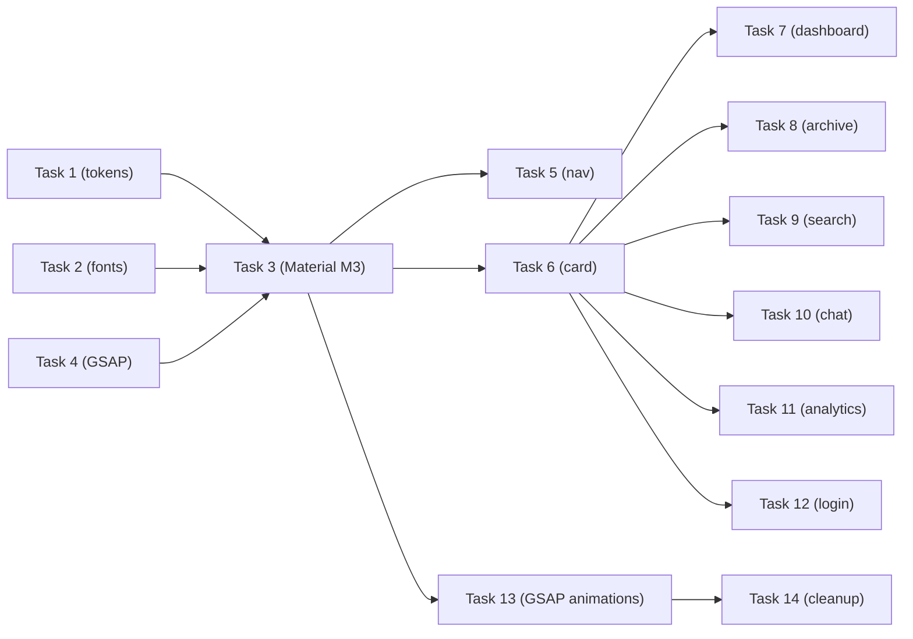

# Editorial Design Integration — Implementation Plan

> **For Claude:** REQUIRED SUB-SKILL: Use superpowers:executing-plans to implement this plan task-by-task.

**Goal:** Replace the generic Angular Material aesthetic with a premium editorial/newspaper design (validated in the POC at `/poc`) across all pages and components.

**Architecture:** Update global design tokens and Material M3 overrides as foundation, then restyle each page/component with the editorial aesthetic (hard borders, Space Grotesk headings, IBM Plex Mono data, cream/charcoal light + terminal dark). Install GSAP for premium animations. Each page is independent after the foundation tasks.

**Tech Stack:** Angular 21, Angular Material M3 (functional only), SCSS + CSS custom properties, GSAP (new), Highcharts, View Transitions API

---

## Task 1: Global Tokens — Editorial Palette

**Files:**
- Modify: `web/src/styles/_tokens.scss`

**What changes:**
Replace indigo/violet palette with editorial palette. Keep same CSS variable NAMES so all existing `var(--*)` references auto-update.

**Step 1: Update light mode tokens**

```scss
:root {
  // Surfaces — cream editorial
  --bg-base: #F9F7F2;
  --bg-surface: #FFFFFF;
  --bg-elevated: #f5f5f0;
  --bg-hover: #EDECE8;

  // Accent — terracotta
  --accent: #C05E4E;
  --accent-dim: #A34B3C;
  --accent-glow: rgba(192, 94, 78, 0.10);

  // Text — charcoal
  --text-primary: #1A1A1A;
  --text-secondary: #4A4A4A;
  --text-muted: #8A8A8A;

  // Borders — hard editorial
  --border: rgba(26, 26, 26, 0.15);
  --border-hover: rgba(26, 26, 26, 0.30);
  --border-accent: rgba(192, 94, 78, 0.30);

  // Semantic (keep)
  --error: #EF4444;
  --error-subtle: rgba(239, 68, 68, 0.08);
  --success: #2D4739;
  --warning: #E8A317;

  // Editorial accents
  --ed-terracotta: #C05E4E;
  --ed-forest: #2D4739;
  --ed-stat-shadow: 4px 4px 0px #C05E4E;
  --ed-status-color: #2D4739;

  // Source colors (keep existing)
  --source-hackernews: #FF6600;
  --source-arxiv: #B31B1B;
  --source-github: #8B5CF6;
  --source-rss: #E8A317;
  --source-huggingface: #FFD21E;
  --source-reddit: #FF4500;

  // Topic colors (keep existing)
  --topic-modelos: #6366F1;
  --topic-herramientas: #10B981;
  --topic-papers: #F59E0B;
  --topic-open_source: #8B5CF6;
  --topic-productos: #06B6D4;
  --topic-agentes: #F43F5E;
  --topic-regulacion: #64748B;

  // Shadows — minimal editorial
  --shadow-sm: none;
  --shadow-md: none;
  --shadow-lg: none;
  --shadow-glow: 0 0 0 2px var(--accent-glow);
}
```

**Step 2: Update dark mode tokens**

```scss
.dark {
  --bg-base: #0A0A0A;
  --bg-surface: #111111;
  --bg-elevated: #141414;
  --bg-hover: #1E1E1E;

  --accent: #4ADE80;
  --accent-dim: #22C55E;
  --accent-glow: rgba(74, 222, 128, 0.12);

  --text-primary: #E0E0E0;
  --text-secondary: #A0A0A0;
  --text-muted: #606060;

  --border: rgba(255, 255, 255, 0.10);
  --border-hover: rgba(255, 255, 255, 0.18);
  --border-accent: rgba(74, 222, 128, 0.25);

  --error: #EF4444;
  --error-subtle: rgba(239, 68, 68, 0.08);
  --success: #4ADE80;
  --warning: #E8A317;

  --ed-terracotta: #EF6B5A;
  --ed-forest: #4ADE80;
  --ed-stat-shadow: 4px 4px 0px #4ADE80;
  --ed-status-color: #4ADE80;

  // Topic colors (brighter for dark bg)
  --topic-modelos: #818CF8;
  --topic-herramientas: #34D399;
  --topic-papers: #FBBF24;
  --topic-open_source: #A78BFA;
  --topic-productos: #22D3EE;
  --topic-agentes: #FB7185;
  --topic-regulacion: #94A3B8;

  // Source colors (same brand)
  --source-hackernews: #FF6600;
  --source-arxiv: #EF6B5A;
  --source-github: #A78BFA;
  --source-rss: #E8A317;
  --source-huggingface: #FFD21E;
  --source-reddit: #FF4500;

  --shadow-sm: none;
  --shadow-md: none;
  --shadow-lg: none;
  --shadow-glow: 0 0 0 2px var(--accent-glow);
}
```

**Step 3: Build and verify**

Run: `cd web && npx ng build 2>&1 | tail -5`
Expected: Build succeeds (only Highcharts ESM warning)

**Step 4: Commit**

```bash
git add web/src/styles/_tokens.scss
git commit -m "feat(ui): editorial palette — global design tokens [Track A]"
```

---

## Task 2: Typography — Editorial Fonts

**Files:**
- Modify: `web/src/styles/_typography.scss`

**Step 1: Update font families**

```scss
:root {
  // Font families — editorial
  --font-heading: 'Space Grotesk', 'Plus Jakarta Sans', sans-serif;
  --font-body: 'Inter', 'Plus Jakarta Sans', sans-serif;
  --font-mono: 'IBM Plex Mono', 'JetBrains Mono', monospace;

  // Type scale (keep existing values)
  --text-xs: 0.6875rem;
  --text-sm: 0.8125rem;
  --text-base: 0.9375rem;
  --text-lg: 1.125rem;
  --text-xl: 1.5rem;
  --text-2xl: 2rem;
  --text-display: 2.5rem;

  // Line heights (keep)
  --leading-tight: 1.25;
  --leading-snug: 1.35;
  --leading-normal: 1.5;
  --leading-relaxed: 1.65;

  // Letter spacing (keep)
  --tracking-tight: -0.025em;
  --tracking-normal: 0;
  --tracking-wide: 0.02em;
  --tracking-wider: 0.06em;
}
```

Note: Fonts are already loaded in `index.html` (added during POC). Fallbacks to Plus Jakarta Sans / JetBrains Mono ensure backward compat if fonts fail to load.

**Step 2: Build and verify**

Run: `cd web && npx ng build 2>&1 | tail -5`

**Step 3: Commit**

```bash
git add web/src/styles/_typography.scss
git commit -m "feat(ui): editorial typography — Space Grotesk + IBM Plex Mono + Inter [Track A]"
```

---

## Task 3: Material M3 Theme + Surface Overrides

**Files:**
- Modify: `web/src/styles/styles.scss`
- Modify: `web/src/styles/_surfaces.scss`
- Modify: `web/src/styles/_layout.scss`

**Step 1: Update Material M3 theme in `styles.scss`**

Replace violet palette and overrides. Key changes:
- Dark theme: use `mat.$red-palette` or custom palette matching terracotta/green
- Light theme: same approach
- Material surface overrides: map to editorial tokens
- Typography: `Inter` as primary font for Material

```scss
// styles.scss — Dark mode
html.dark {
  @include mat.theme((
    color: (
      primary: mat.$green-palette,
      tertiary: mat.$green-palette,
      theme-type: dark,
    ),
    typography: Inter,
    density: 0,
  ));
  @include mat.theme-overrides((
    surface: #111111,
    surface-container: #111111,
    surface-container-low: #0D0D0D,
    surface-container-high: #141414,
    surface-container-highest: #1E1E1E,
    surface-dim: #0A0A0A,
    on-surface: #E0E0E0,
    on-surface-variant: #A0A0A0,
    outline: rgba(255, 255, 255, 0.10),
    outline-variant: rgba(255, 255, 255, 0.06),
  ));
}

// Light mode
html:not(.dark) {
  @include mat.theme((
    color: (
      primary: mat.$red-palette,
      tertiary: mat.$red-palette,
      theme-type: light,
    ),
    typography: Inter,
    density: 0,
  ));
  @include mat.theme-overrides((
    surface: #FFFFFF,
    surface-container: #FFFFFF,
    surface-container-low: #F9F7F2,
    surface-container-high: #f5f5f0,
    surface-container-highest: #EDECE8,
    surface-dim: #f5f5f0,
    on-surface: #1A1A1A,
    on-surface-variant: #4A4A4A,
    outline: rgba(26, 26, 26, 0.15),
    outline-variant: rgba(26, 26, 26, 0.06),
  ));
}
```

**Step 2: Update card/form styles in `_surfaces.scss`**

Key changes:
- `.mat-mdc-card`: border-radius `2px` (was 14px), no shadow, 1px solid border
- `.mat-mdc-form-field .mdc-text-field--outlined`: border-radius `4px` (was 10px)
- `.mat-mdc-select-panel`: border-radius `4px` (was 12px)
- `.mat-datepicker-content`: border-radius `4px` (was 14px)
- `.mat-mdc-chip`: no round pill, use `4px` radius
- `.stats-bar`: border-radius `2px` (was 14px)
- `.card`: border-radius `2px` (was 14px)
- Remove `box-shadow` from all light mode cards
- Add `--ed-stat-shadow` to stat module
- `.submit-btn`: border-radius `2px` (was 10px)

**Step 3: Update `_layout.scss`**

- Change `a, button, input, select, textarea` transition from `all` to specific properties: `transition: background 0.15s ease, color 0.15s ease, border-color 0.15s ease;`
- Update focus ring to editorial: `box-shadow: 0 0 0 2px var(--accent-glow);`

**Step 4: Build and verify**

Run: `cd web && npx ng build 2>&1 | tail -5`

**Step 5: Commit**

```bash
git add web/src/styles/styles.scss web/src/styles/_surfaces.scss web/src/styles/_layout.scss
git commit -m "feat(ui): Material M3 editorial theme — hard borders, no shadows, 2px radius [Track A]"
```

---

## Task 4: Install GSAP + Expand Animations

**Files:**
- Modify: `web/package.json` (via npm install)
- Modify: `web/src/styles/_animations.scss`

**Step 1: Install GSAP**

Run: `cd web && npm install gsap`

**Step 2: Update `_animations.scss`**

Keep existing keyframes, update View Transitions for editorial feel:

```scss
// View Transitions — editorial fade + slide
::view-transition-old(root) {
  animation: 120ms ease-in vt-fade-out;
}
::view-transition-new(root) {
  animation: 250ms ease-out vt-fade-slide-in;
}

// Named view transitions for hero cards
::view-transition-old(hero-card) {
  animation: 150ms ease-in vt-fade-out;
}
::view-transition-new(hero-card) {
  animation: 300ms ease-out vt-fade-slide-in;
}
```

Add editorial-specific keyframes:

```scss
@keyframes pulse-dot {
  0%, 100% { opacity: 1; }
  50% { opacity: 0.4; }
}

@keyframes stat-count-in {
  from { opacity: 0; transform: translateY(8px); }
  to { opacity: 1; transform: translateY(0); }
}
```

**Step 3: Build and verify**

Run: `cd web && npx ng build 2>&1 | tail -5`

**Step 4: Commit**

```bash
git add web/package.json web/package-lock.json web/src/styles/_animations.scss
git commit -m "feat(ui): install GSAP + editorial animation keyframes [Track A]"
```

---

## Task 5: App Shell — Editorial Navigation

**Files:**
- Modify: `web/src/app/app.ts`

**What changes:**
- Brand: "AI NEWS AGGREGATOR" in Space Grotesk, uppercase, tracking-tight
- Nav links: IBM Plex Mono, uppercase, 10px, letter-spacing
- Theme toggle: only dark/light cycle (remove "system")
- Hard border bottom (no backdrop-filter glass)
- Status dot indicator next to brand
- Editorial nav link underline (hard 2px line, not animated width)
- Background: solid `var(--bg-surface)` (no glass/blur)

Key CSS changes:
- `.navbar`: `background: var(--bg-surface)`, remove backdrop-filter
- `.nav-brand`: `font-family: var(--font-heading)`, uppercase, `letter-spacing: -0.03em`
- `.nav-links a`: `font-family: var(--font-mono)`, `font-size: 10px`, `text-transform: uppercase`, `letter-spacing: 0.08em`
- Active underline: solid 2px line below
- `.theme-toggle`: remove rotation animation
- Border: `1px solid var(--text-primary)` (hard editorial border, not semi-transparent)

Key TS changes:
- `cycleTheme()`: toggle between dark/light only (remove system option)
- `currentTheme` type: `'dark' | 'light'` (not `| 'system'`)

**Step 1: Implement changes**

**Step 2: Build and verify**

Run: `cd web && npx ng build 2>&1 | tail -5`

**Step 3: Commit**

```bash
git add web/src/app/app.ts
git commit -m "feat(ui): editorial app shell — hard borders, mono nav, dark/light toggle [Track A]"
```

---

## Task 6: News Item Card — Editorial Redesign

**Files:**
- Modify: `web/src/app/components/news-item-card.ts`

**What changes:**
The shared card component transforms from rounded Material cards to editorial newspaper-style cards:

- Card: 1px solid `var(--text-primary)` border (hard), `var(--bg-surface)` background, `border-radius: 0` (or 2px)
- Header bar: colored by source (terracotta for hackernews, forest for arxiv, etc.), mono uppercase labels
- Title: Space Grotesk, no underline animation (simple `text-decoration: underline` on hover)
- Summary: Inter body text, line-clamp 3
- Footer: border-top 1px solid, mono score/time, source-colored topic tag
- Hero variant: source-colored header bar, larger title, meta grid with score/byline cells
- Remove mat-card dependency — use plain `<article>` elements
- Remove mat-chip dependency — use styled `<span>` for topic badge

Key structural change: Replace `<mat-card>` with `<article class="ed-card">`. This removes the Material card overhead and gives full control.

**Step 1: Implement changes (template + styles + imports)**

Remove: `MatCardModule`, `MatChipsModule` from imports
Add: editorial CSS matching the POC card style

**Step 2: Build and verify**

Run: `cd web && npx ng build 2>&1 | tail -5`

**Step 3: Commit**

```bash
git add web/src/app/components/news-item-card.ts
git commit -m "feat(ui): editorial news card — hard borders, source headers, mono data [Track A]"
```

---

## Task 7: Dashboard — Editorial Integration

**Files:**
- Modify: `web/src/app/pages/dashboard.ts`
- Delete: `web/src/app/pages/dashboard-editorial.ts` (POC)
- Modify: `web/src/app/app.routes.ts` (remove /poc route)

**What changes:**
Merge the validated POC design into the real dashboard. Key elements:

- Header section: "AI NEWS AGGREGATOR" title, vol/date, status dot
- Stats module: dark bg box with terracotta shadow (editorial `stat-module`)
- Topic filters: mono chips with hard borders (no mat-chip-listbox)
- Hero card: "Featured Analysis" with source-colored header
- News grid: 2-column grid "The Dispatch" section
- Remove: `MatCardModule`, `MatChipsModule`, `MatProgressBarModule`, `MatButtonModule`, `MatIconModule`
- Add: editorial CSS from POC (adapted to use global tokens instead of `:host` local tokens)

Important: The POC used self-contained `--ed-*` tokens. The real dashboard should use the global `--accent`, `--bg-base` etc tokens (updated in Task 1) plus the new `--ed-terracotta`, `--ed-forest`, `--ed-stat-shadow` tokens.

Also add the fallback to `getTodayItems()` when briefing has empty items (fix from POC).

**Step 1: Replace dashboard template and styles with editorial design**

**Step 2: Remove POC component and route**

```bash
rm web/src/app/pages/dashboard-editorial.ts
```

Update `app.routes.ts`: remove `/poc` route and `DashboardEditorialPage` import.

**Step 3: Build and verify**

Run: `cd web && npx ng build 2>&1 | tail -5`

**Step 4: Commit**

```bash
git add web/src/app/pages/dashboard.ts web/src/app/app.routes.ts
git rm web/src/app/pages/dashboard-editorial.ts
git commit -m "feat(ui): editorial dashboard — hero card, stat module, dispatch grid [Track A]"
```

---

## Task 8: Archive — Editorial Redesign

**Files:**
- Modify: `web/src/app/pages/archive.ts`

**What changes:**
- Keep Material form fields (date picker, select) — these are functional components
- Replace stats-bar with editorial `stat-module` (same as dashboard)
- Replace topic chips with editorial mono chips (hard border, not rounded pills)
- Replace `<app-news-item-card>` list layout with editorial card grid
- Add editorial header: "ARCHIVO" title with section line
- Count label: mono, uppercase
- Error/empty states: editorial style (hard border, no rounded corners)

**Step 1: Implement changes**

**Step 2: Build and verify**

Run: `cd web && npx ng build 2>&1 | tail -5`

**Step 3: Commit**

```bash
git add web/src/app/pages/archive.ts
git commit -m "feat(ui): editorial archive — stat module, mono chips, section headers [Track A]"
```

---

## Task 9: Search — Editorial Redesign

**Files:**
- Modify: `web/src/app/pages/search.ts`

**What changes:**
- Keep Material form fields (search input, selects, datepickers)
- Submit button: editorial style (hard border, mono text)
- Empty state: editorial icon + mono text, quick chips with hard borders
- Results: editorial card list
- Count label: mono, uppercase
- Remove: floating icon animation (replace with static editorial icon)

**Step 1: Implement changes**

**Step 2: Build and verify**

Run: `cd web && npx ng build 2>&1 | tail -5`

**Step 3: Commit**

```bash
git add web/src/app/pages/search.ts
git commit -m "feat(ui): editorial search — hard borders, mono chips, editorial results [Track A]"
```

---

## Task 10: Chat — Editorial Redesign

**Files:**
- Modify: `web/src/app/pages/chat.ts`

**What changes:**
- Welcome state: editorial style (no gradient glow, no radial gradient)
  - Title: Space Grotesk, no gradient text fill
  - Suggestion chips: editorial cards with hard borders, source-colored left accent
- User messages: `var(--accent)` bg (terracotta light / green dark)
- Assistant messages: `var(--bg-elevated)` bg, 1px hard border, no rounded 18px (use 2px)
- Code blocks: editorial mono style with hard borders
- Sources: editorial pills with hard borders
- Input bar: solid background, hard border-top, no backdrop blur
- Cursor: accent-colored blink

**Step 1: Implement changes**

**Step 2: Build and verify**

Run: `cd web && npx ng build 2>&1 | tail -5`

**Step 3: Commit**

```bash
git add web/src/app/pages/chat.ts
git commit -m "feat(ui): editorial chat — hard borders, mono sources, editorial bubbles [Track A]"
```

---

## Task 11: Analytics — Editorial Highcharts Theme

**Files:**
- Modify: `web/src/app/pages/analytics.ts`

**What changes:**
- Chart theme: editorial palette (terracotta/forest for light, green/red for dark)
- Cards: editorial style (hard borders, 2px radius)
- Chart heading: Space Grotesk, uppercase, editorial dot accent
- Colors:
  - Area chart: terracotta fill (light) / green fill (dark) instead of indigo
  - Pie chart: editorial palette (terracotta, forest, warm tones)
  - Bar chart: keep source brand colors
- Tooltip: editorial style (hard border, no shadow, 2px radius)
- Marker: editorial style (no line-width glow)

**Step 1: Implement changes**

**Step 2: Build and verify**

Run: `cd web && npx ng build 2>&1 | tail -5`

**Step 3: Commit**

```bash
git add web/src/app/pages/analytics.ts
git commit -m "feat(ui): editorial analytics — terracotta/forest chart theme [Track A]"
```

---

## Task 12: Login — Editorial Redesign

**Files:**
- Modify: `web/src/app/pages/login.ts`

**What changes:**
- Remove radial gradient glow backgrounds (`::before`, `::after`)
- Card: editorial style with hard border, no rounded corners
- Title: "AI NEWS AGGREGATOR" in Space Grotesk, uppercase, tracking-tight
- Subtitle: Inter, editorial muted text
- Button: editorial style (hard border, 2px radius)
- Add editorial decorative element: thin rule line or status indicator
- Background: solid `var(--bg-base)` cream/dark

**Step 1: Implement changes**

**Step 2: Build and verify**

Run: `cd web && npx ng build 2>&1 | tail -5`

**Step 3: Commit**

```bash
git add web/src/app/pages/login.ts
git commit -m "feat(ui): editorial login — hard borders, Space Grotesk title [Track A]"
```

---

## Task 13: GSAP Animations — Premium Micro-interactions

**Files:**
- Modify: `web/src/app/pages/dashboard.ts` (add GSAP stagger for cards)
- Modify: `web/src/app/components/news-item-card.ts` (add spring hover)
- Modify: `web/src/app/pages/search.ts` (stagger results)
- Modify: `web/src/app/pages/archive.ts` (stagger results)

**What changes:**
Replace CSS `animation-delay: i * 50ms` inline style hack with proper GSAP stagger. Add GSAP-powered interactions:

1. **Card stagger entry**: On data load, stagger cards in with `gsap.from('.ed-card', { y: 20, opacity: 0, stagger: 0.06 })`
2. **Stat counter**: Animate stat numbers counting up with `gsap.to()` on load
3. **Card hover lift**: Replace CSS `transform: translateY(-2px)` with GSAP spring

Implementation pattern for Angular:
```typescript
import { afterNextRender } from '@angular/core';

// In constructor or ngOnInit:
afterNextRender(async () => {
  const { gsap } = await import('gsap');
  gsap.from('.ed-card', {
    y: 20,
    opacity: 0,
    duration: 0.4,
    stagger: 0.06,
    ease: 'power2.out',
  });
});
```

**Step 1: Add GSAP stagger to dashboard card grid**

**Step 2: Add GSAP stagger to search results and archive list**

**Step 3: Add GSAP stat counter animation to stat module**

**Step 4: Build and verify**

Run: `cd web && npx ng build 2>&1 | tail -5`

**Step 5: Commit**

```bash
git add web/src/app/pages/dashboard.ts web/src/app/components/news-item-card.ts web/src/app/pages/search.ts web/src/app/pages/archive.ts
git commit -m "feat(ui): GSAP animations — card stagger, stat counters, spring hover [Track A]"
```

---

## Task 14: Cleanup + Visual Regression Snapshots

**Files:**
- Modify: `web/e2e/visual-pages.spec.ts` (if snapshot names changed)
- Update: visual regression snapshots

**Step 1: Verify full build**

Run: `cd web && npx ng build 2>&1 | tail -5`

**Step 2: Run e2e visual snapshot update**

Run: `cd web && npm run e2e:visual:update`

**Step 3: Verify app manually**

Open app, check all pages in both light and dark mode:
- [ ] Login
- [ ] Dashboard (light + dark)
- [ ] Archive (light + dark)
- [ ] Search (light + dark)
- [ ] Chat (light + dark)
- [ ] Analytics (light + dark)

**Step 4: Commit**

```bash
git add -A
git commit -m "chore(ui): update visual regression snapshots for editorial redesign [Track A]"
```

---

## Dependency Graph



Tasks 7-12 (page redesigns) are independent and can run in parallel after Tasks 1-6 are done.
Task 13 (GSAP) requires pages to be done.
Task 14 (cleanup) is always last.

---

## Reference Files

| File | Role |
|------|------|
| `web/stitch-dashboard-test/screen.png` | Light mode reference (Stitch) |
| `web/stitch-dashboard-test/dark-mode.png` | Dark mode reference (Stitch) |
| `web/stitch-dashboard-test/code.html` | Stitch HTML output (for CSS values) |
| `web/src/app/pages/dashboard-editorial.ts` | Validated Angular POC (remove after Task 7) |
| `docs/plans/2026-02-22-stitch-redesign-design.md` | Design decisions document |

---

*Plan created: 22 de febrero de 2026*
