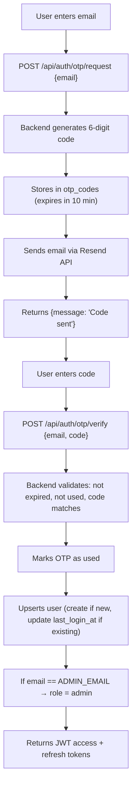

# Multi-User Auth — Design Doc

**Date**: 2026-02-25
**Status**: Approved
**Goal**: Replace shared password with real user accounts. Passwordless email OTP via Resend. Two roles: admin/reader.

---

## Scope

- **Users table** in PostgreSQL with email, name, role
- **Passwordless auth** via email OTP (6-digit code sent by Resend)
- **Two roles**: `admin` and `reader`
- **Superadmin** defined by `ADMIN_EMAIL` env var (auto-assigned on first login)
- **Open registration** — any email can sign up
- **Backward compatible** — shared password login kept but deprecated
- **Frontend** — new Login page with email OTP flow

**Not in scope**: Google OAuth, password-based auth, 2FA, user management UI, profile page.

---

## Architecture

### Database

New Alembic migration with two tables:

**`users`**

| Column | Type | Notes |
|--------|------|-------|
| id | UUID | PK, gen_random_uuid() |
| email | TEXT | UNIQUE, NOT NULL, lowercase |
| name | TEXT | Email prefix by default |
| role | VARCHAR(20) | `admin` or `reader`, default `reader` |
| created_at | TIMESTAMPTZ | Default NOW() |
| last_login_at | TIMESTAMPTZ | Updated on each login |

**`otp_codes`**

| Column | Type | Notes |
|--------|------|-------|
| id | SERIAL | PK |
| email | TEXT | NOT NULL, lowercase |
| code | VARCHAR(6) | 6-digit numeric |
| expires_at | TIMESTAMPTZ | created_at + 10 min |
| used | BOOLEAN | Default false |
| created_at | TIMESTAMPTZ | Default NOW() |

Index on `otp_codes(email, used, expires_at)` for lookup queries.

### Auth Flow



### OTP Security

- **6 digits** (000000-999999) — standard for email OTP
- **10 minute expiry** — enough time to check email
- **Single use** — marked `used=true` after verification
- **Rate limited** — `POST /api/auth/otp/request` limited to 3/minute per IP
- **Brute force protection** — `POST /api/auth/otp/verify` limited to 5/minute per IP
- **Max 3 active codes per email** — old unused codes invalidated when new one requested
- **Code generation** — `secrets.randbelow(1_000_000)` (cryptographically secure)
- **Timing-safe comparison** — `hmac.compare_digest` for code verification

### JWT Changes

Current payload: `{"sub": "user", "type": "access"}`

New payload: `{"sub": "<user-uuid>", "role": "admin|reader", "email": "<email>", "type": "access"}`

- `require_auth` returns a `UserClaims` dataclass (id, role, email) instead of bare string
- New `require_admin` dependency: calls `require_auth`, then checks `role == "admin"`
- Refresh tokens unchanged (same rotation mechanism, same in-memory store)

### Roles

| Action | reader | admin |
|--------|--------|-------|
| View news, search, trending | yes | yes |
| Use chat | yes | yes |
| View analytics | yes | yes |
| Pipeline status (future) | no | yes |
| User management (future) | no | yes |

For now, `reader` and `admin` have identical access to all existing endpoints. The role infrastructure exists for future admin-only features.

### Email via Resend

```python
# One httpx POST call — no SDK dependency needed
async def send_otp_email(email: str, code: str) -> None:
    async with httpx.AsyncClient() as client:
        await client.post(
            "https://api.resend.com/emails",
            headers={"Authorization": f"Bearer {RESEND_API_KEY}"},
            json={
                "from": OTP_FROM_EMAIL,
                "to": [email],
                "subject": "Tu código de acceso — AI News",
                "html": f"<p>Tu código es: <strong>{code}</strong></p><p>Expira en 10 minutos.</p>",
            },
        )
```

No new dependency — plain `httpx` (already in project). No Resend SDK needed.

### New Config Settings

```python
# --- Auth ---
admin_email: str = ""              # Superadmin email (auto-admin on first login)
resend_api_key: str = ""           # Resend API key for OTP emails
otp_from_email: str = "noreply@resend.dev"  # Sender email for OTP
otp_expire_minutes: int = 10       # OTP code expiry
otp_max_active: int = 3            # Max active codes per email
```

### New API Endpoints

| Method | Path | Auth | Description |
|--------|------|------|-------------|
| POST | /api/auth/otp/request | No | Request OTP code (sends email) |
| POST | /api/auth/otp/verify | No | Verify OTP code → JWT tokens |
| GET | /api/auth/me | JWT | Return current user info (id, email, name, role) |

### Migration from Shared Password

1. Shared password login (`POST /api/auth/token`) kept working — returns JWT with `sub: "legacy"`, `role: "reader"`
2. Frontend Login page shows email OTP as primary, shared password as "legacy login" link (small text)
3. Once all users migrated, shared password endpoint can be removed

### Frontend Changes

Login page (`Login.tsx`):
- **Step 1**: Email input + "Send code" button
- **Step 2**: 6-digit code input (appears after email sent) + "Verify" button
- Small link at bottom: "Login with shared password" (legacy, for transition)

Auth context (`use-auth.tsx`):
- `useAuth` exposes `user: { id, email, name, role }` from JWT claims
- Token storage unchanged (localStorage)

---

## What Stays Unchanged

- All existing API endpoints (items, search, chat, etc.)
- JWT refresh token rotation mechanism
- Rate limiting infrastructure
- Frontend pages (except Login)
- Pipeline, scheduler, extractors
- Docker setup

## Dependencies

- No new Python dependencies (httpx already available for Resend API calls)
- New Alembic migration (`005_users_and_otp.py`)

## Error Handling

- Resend API down → return 503 "Email service unavailable, try again later"
- Invalid/expired OTP → return 401 "Invalid or expired code"
- Rate limit exceeded → return 429 (existing slowapi behavior)
- Email not delivered → user retries (OTP request is idempotent, generates new code)

## OTP Cleanup

APScheduler job (add to existing scheduler): purge expired `otp_codes` rows daily.
Simple `DELETE FROM otp_codes WHERE expires_at < NOW() - INTERVAL '1 day'`.

---

## Summary

| Aspect | Before | After |
|--------|--------|-------|
| Auth method | Shared password | Email OTP (passwordless) |
| User identity | None (`sub: "user"`) | Real users (`sub: UUID`) |
| Roles | None | admin / reader |
| Registration | N/A | Open (any email) |
| Password storage | None (shared in .env) | None (passwordless) |
| Email service | None | Resend (free tier, 3K/mo) |
| New dependencies | None | None (httpx reused) |
| Migration | Alembic 005 | users + otp_codes tables |
