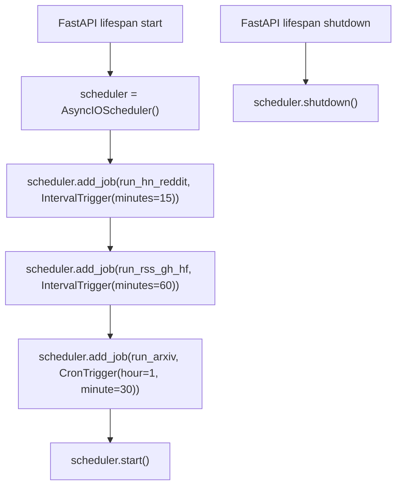

# Pipeline Scheduling + Live Feeds — Design Doc

**Date**: 2026-02-25
**Status**: Approved
**Goal**: Replace daily cron with per-source APScheduler intervals. Add Reddit OAuth, RSS ETags, HF daily_papers.

---

## Scope

- **APScheduler** integrated in FastAPI lifespan with per-source intervals
- **Pipeline refactor** to support running subsets of extractors
- **Reddit OAuth** for 10x higher rate limits and stability
- **RSS ETags** (If-Modified-Since / ETag) to skip unchanged feeds
- **HuggingFace daily_papers** endpoint integration

**Not in scope**: Firebase SSE for HN real-time, WebSub, Celery, new frontend features.

---

## Architecture

### Scheduling Tiers

| Tier | Interval | Sources |
|------|----------|---------|
| Tier 1 | Every 15 min | HackerNews, Reddit |
| Tier 2 | Every 60 min | RSS feeds, GitHub, HuggingFace |
| Tier 3 | Daily at 01:30 UTC | arXiv |

### APScheduler in FastAPI

APScheduler `AsyncIOScheduler` starts/stops in the FastAPI `lifespan` handler. Each source (or source group) is a separate job. Jobs run concurrently but each gets its own DB session.



### Pipeline Refactor

Current: `run_pipeline(session)` runs all extractors.

New: `run_pipeline(session, sources=None)` accepts an optional list of source names. If `None`, runs all (backward compatible with CLI). Each scheduler job calls with its tier's sources.

```python
# Tier 1 job
await run_pipeline(session, sources=["hackernews", "reddit"])

# Tier 2 job
await run_pipeline(session, sources=["rss", "github", "huggingface"])

# Tier 3 job
await run_pipeline(session, sources=["arxiv"])
```

### Reddit OAuth

Replace unauthenticated `.json` scraping with OAuth client_credentials flow:

1. `POST https://www.reddit.com/api/v1/access_token` with client_id/secret → bearer token (2h TTL)
2. Use `Authorization: Bearer <token>` on `oauth.reddit.com` endpoints
3. Rate limit: 100 req/min (vs 10 req/min unauthenticated)
4. Cache token in memory, refresh when expired

No asyncpraw dependency — plain httpx with OAuth token. The extractor interface stays the same.

### RSS ETags

Add conditional request headers to `RSSExtractor`:

- Store `ETag` and `Last-Modified` per feed URL in a module-level dict
- Send `If-None-Match` / `If-Modified-Since` on subsequent requests
- On 304: return empty list, log "feed unchanged"
- State resets on process restart (acceptable — first poll always fetches)

### HuggingFace daily_papers

Add to `HuggingFaceExtractor.extract()`:

- `GET https://huggingface.co/api/daily_papers` returns curated AI papers
- Parse each paper as `ExtractedItem` with `source="huggingface"`, URL = arxiv link
- Dedup handled by existing pipeline (URL-based)
- Only fetch once per day (HF updates daily_papers once/day)

---

## New Config Settings

```python
# Scheduler
scheduler_enabled: bool = True
hn_poll_interval_minutes: int = 15
reddit_poll_interval_minutes: int = 15
rss_poll_interval_minutes: int = 60
github_poll_interval_minutes: int = 60
hf_poll_interval_minutes: int = 60
arxiv_cron_hour: int = 1
arxiv_cron_minute: int = 30

# Reddit OAuth (required for Reddit source)
reddit_client_id: str = ""
reddit_client_secret: str = ""
```

---

## Error Handling

- Each job runs in try/except — failure in one source does not block others
- Circuit breaker: 3 consecutive failures → disable source for 1 hour, alert via Telegram
- Per-job Prometheus metrics: duration, success count, failure count
- Structured logging with `correlation_id` per job execution

---

## What Stays Unchanged

- Pipeline flow: extract → dedup → classify → validate → store → briefing → notify
- All API endpoints
- Frontend
- CLI entry point (`python -m src.main` still runs all sources once)
- Docker `pipeline-cron` service kept but deprecated (docs updated)

---

## Dependencies

- New: `apscheduler~=3.10` (AsyncIOScheduler, no external broker needed)
- No other new dependencies

---

## Migration

1. Add `apscheduler` to `pyproject.toml`
2. Implement changes
3. Update `.env.example` with new settings
4. Update `AGENTS.md` with scheduler architecture
5. Docker: `pipeline-cron` profile becomes optional (scheduler runs in API process)
