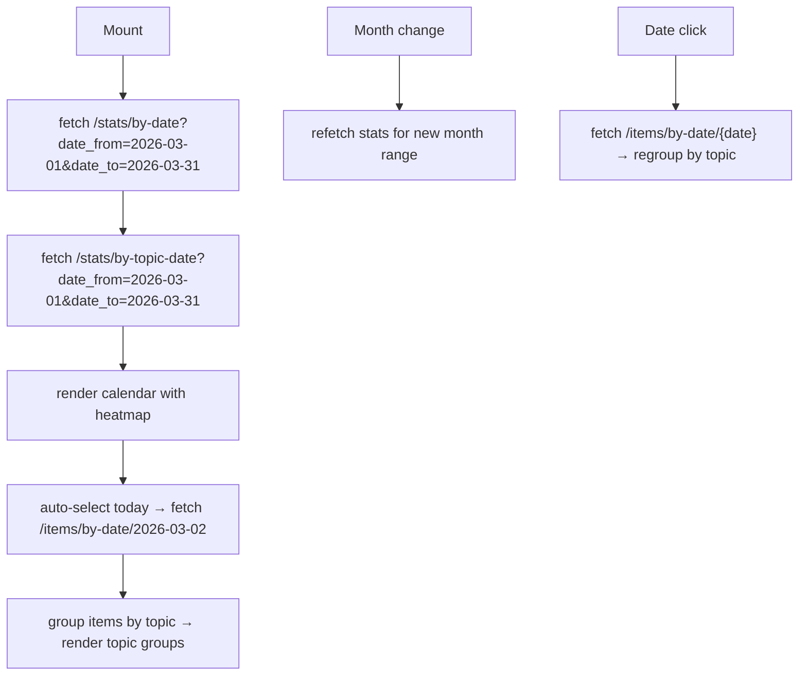

# Timeline Section — Design Document

> **Date**: 2026-03-02
> **Status**: Approved
> **Approach**: Heatmap calendar + topic-grouped items (Approach C)

## Problem

The frontend has Feed (relevance-sorted), Top (score-sorted), and Search (full-text). There's no
way to browse by date — "what happened yesterday?" or "what was the news on Feb 15th?" requires
guessing via search. A temporal browsing section fills this gap.

## Design

### Route & Navigation

- **Route**: `/timeline`
- **Nav entry**: Between "Search" and the settings icon in `app-nav.tsx`
- **Icon**: `Calendar` (lucide-react)

### Layout

```
┌─────────────────────────────────────────┐
│  ◀  March 2026  ▶                       │
├─────────────────────────────────────────┤
│  Mo  Tu  We  Th  Fr  Sa  Su            │
│                           1·            │
│  [2]  3●  4·  5   6●  7   8            │
│   9  10  11  12  13  14  15            │
│  · = few items, ● = many items          │
│  (scale relative to month's max)        │
├─────────────────────────────────────────┤
│  March 2, 2026              42 items    │
├─────────────────────────────────────────┤
│  ▾ Models (12)                          │
│    ┌ NewsCard ┐ ┌ NewsCard ┐            │
│    └──────────┘ └──────────┘            │
│  ▾ Agents (9)                           │
│    ┌ NewsCard ┐ ┌ NewsCard ┐            │
│    └──────────┘ └──────────┘            │
│  ▸ Tools (8)  — collapsed              │
│  ▸ Papers (7) — collapsed              │
│  ...                                    │
└─────────────────────────────────────────┘
```

### Behavior

1. **Default**: Today's date selected, current month displayed.
2. **Month navigation**: `<`/`>` arrows change month. No lower bound (full history back to ~2023).
   Upper bound = current month. Fetches heatmap data for new month on change.
3. **Date click**: Fetches items for that date, displays grouped by topic.
4. **Heatmap scale**: Relative to the month's max count — a sparse month with max 5 items/day
   shows meaningful gradients, same as a dense month with 50 items/day.
5. **Topic groups**: Sorted by item count descending. Top 2 expanded, rest collapsed.
   Click header to toggle.
6. **Items within group**: Sorted by `composite_score` descending. Reuses existing `NewsCard`.
7. **Empty dates**: "No items for this date" message.
8. **Empty months**: Calendar renders normally with no dots. Navigation still works.

### Date Handling

All endpoints use `effective_date = COALESCE(published_at, created_at)`, so:
- Backfilled items show at their real publication date (e.g., 2023 HN story shows in 2023)
- WebScraper items (no `published_at`) fall back to `created_at` (insertion time)
- No clustering around backfill dates

### API Endpoints

| Endpoint | Purpose | Change needed |
|---|---|---|
| `GET /stats/by-date` | Heatmap: item counts per date | Add `date_from`/`date_to` params |
| `GET /stats/by-topic-date` | Topic breakdown per date | Add `date_from`/`date_to` params |
| `GET /items/by-date/{date}` | Items for selected date | No change |

**Backend enhancement**: Add optional `date_from` and `date_to` (ISO date strings) to
`/stats/by-date` and `/stats/by-topic-date`. When provided, use date range instead of `days`
lookback. This enables efficient per-month queries for historical navigation.

### Frontend Components

| Component | Description |
|---|---|
| `Timeline.tsx` | Page component, route `/timeline` |
| `calendar-heatmap.tsx` | Calendar grid with month nav + relative activity dots |
| `topic-group.tsx` | Collapsible topic section with count badge + NewsCard list |

### Data Flow



## Future Section Ideas (Backlog)

These were discussed during brainstorming and deferred:

1. **Daily Briefing page** — Backend already generates LLM briefings (`/briefings`).
   Surface them in a dedicated page. Lowest effort of the four.
2. **Analytics Dashboard** — 8 stats endpoints are unused. Charts: topic trends,
   source breakdown, trending timeline, score distribution.
3. **Discovery / Similar** — "More like this" recommendations using pgvector similarity.
   Cross-topic connections, emerging patterns.
